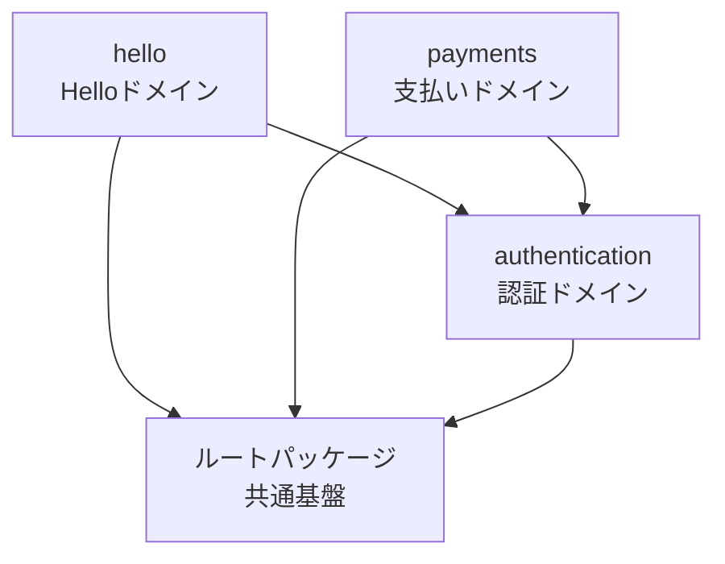

# スーパー支払い君RB.com

Ruby on Rails 7.2で構築した企業向け支払い管理システムのREST APIサービスです。

## クイックスタート

### 前提条件
- Ruby 3.4.6
- Docker & Docker Compose

### 開発環境起動（推奨）
```bash
# 1. PostgreSQL起動
docker compose up -d

# 2. 依存関係インストール
bundle install

# 3. データベース作成・マイグレーション
rails db:create db:migrate

# 4. アプリケーション起動
rails s
```

### テスト実行
```bash
# 全テスト実行
bundle exec rspec

# 特定のスペックのみ実行
bundle exec rspec spec/requests/hello_spec.rb
```

## プロジェクト概要

企業向け支払い管理システムの機能：
- ユーザー管理: 法人ユーザーの登録・JWT認証
- 請求書管理: 請求書登録・一覧表示・手数料自動計算
- 手数料計算: 支払金額の4% + 消費税10%

## 技術スタック

| 技術         | バージョン | 用途          |
|------------|-------|-------------|
| Ruby       | 3.4.6 | メイン言語       |
| Rails      | 7.2.2 | Webフレームワーク  |
| PostgreSQL | 16    | データベース      |
| RSpec      | 7.1   | テストフレームワーク |
| Puma       | -     | Webサーバー     |
| Packwerk   | 3.2   | パッケージ管理     |

## アーキテクチャ

このプロジェクトは**モジュラーモノリス**アーキテクチャを採用しています。

モジュラーモノリスは、単一のアプリケーション内でドメインごとにモジュール（パッケージ）を分離する設計手法です。マイクロサービスの利点（独立性、保守性）とモノリスの利点（シンプルさ、パフォーマンス）を両立します。

詳細は [モジュラーモノリスアーキテクチャ](doc/modular_monolith.md) を参照してください。

### ディレクトリ構造

#### 全体構造

```
app/
├── channels/                         # ActionCable（WebSocket）- 共通基盤のみ
│   └── application_cable/
├── controllers/                      # 共通基盤 - 基底クラスと技術的なconcernのみ
│   ├── application_controller.rb    # 全パッケージの基底クラス
│   └── concerns/                     # 全体で共有する技術的concern
├── jobs/                             # 共通基盤 - 基底クラスのみ
│   └── application_job.rb
├── mailers/                          # 共通基盤 - 基底クラスのみ
│   └── application_mailer.rb
├── middleware/                       # Rackミドルウェア（全体に影響）
│   └── request_trace_id.rb
├── models/                           # 共通基盤 - 基底クラスと技術的なconcernのみ
│   ├── application_record.rb        # 全パッケージの基底クラス
│   └── concerns/                     # 全体で共有する技術的concern
└── packages/                         # ビジネスロジック層（全てのドメイン機能）
    ├── hello/                        # Helloドメイン（サンプル）
    │   ├── package.yml               # パッケージ設定
    │   ├── app/
    │   │   ├── controllers/          # 非公開（内部実装）
    │   │   │   └── hello_controller.rb
    │   │   └── public/               # 公開API（他パッケージから利用可能）
    │   │       └── .keep             # 最初は空でOK
    │   └── spec/
    │       └── requests/
    │           └── hello_spec.rb
    └── authentication/               # 認証ドメイン（計画中）
        ├── package.yml
        ├── app/
        │   ├── controllers/          # 非公開
        │   │   └── sessions_controller.rb
        │   ├── models/               # 非公開（ビジネスロジックはここに）
        │   │   └── user.rb
        │   ├── jobs/                 # 非公開
        │   │   └── user_notification_job.rb
        │   └── public/               # 公開API
        │       └── authenticatable.rb  # 他パッケージから利用可能なconcern
        └── spec/
```

#### 重要な原則

**app直下（共通基盤・インフラ層）:**
- ✅ 基底クラス（Application*）
- ✅ 全パッケージで共有する技術的な機能
- ✅ Rackミドルウェア
- ❌ ビジネスロジック → `app/packages/` へ

**app/packages/（ビジネスロジック層）:**
- ✅ 全てのドメイン固有のController, Model, Job, Mailer
- ✅ ビジネスルール、機能実装
- ✅ Railsの標準構成（MVC）に従う
- ✅ Fat Model, Skinny Controller

**公開APIの方針:**
- デフォルトは全て非公開（packages内のapp/配下）
- 他パッケージから利用されるものだけ `app/public/` に配置

### パッケージ間の依存関係



**依存の方向性ルール:**
- 各ドメインパッケージはルートパッケージに依存できる
- 各ドメインパッケージは認証パッケージに依存できる
- **認証パッケージは他のドメインに依存してはいけない**（Packwerkが強制）
- **循環依存は禁止**（Packwerkが検出）

パッケージの追加方法や依存関係の管理については、[Packwerk使用ガイド](doc/packwerk_guide.md) を参照してください。

## テスト戦略

### RSpecによるテスト
```bash
# 全テスト実行
bundle exec rspec

# 特定のスペックのみ実行
bundle exec rspec spec/requests/hello_spec.rb
```

### テスト設計の原則
- パッケージ単位でテストを記述
- RSpecのリクエストスペックでAPI動作を検証
- RSwagでテストと仕様書を同期

## API仕様

このプロジェクトでは、[RSwag](https://github.com/rswag/rswag)を使用してAPI仕様書を自動生成しています。

- Swagger UI: http://localhost:3000/api-docs
- 定義ファイル: `swagger/v1/swagger.yaml`

詳細は [API仕様書ガイド](doc/api_documentation.md) を参照してください。

## ログとトレーシング

このプロジェクトでは、[SemanticLogger](https://github.com/rocketjob/semantic_logger)によるJSON形式の構造化ログを採用しています。

- **JSON形式**: 全環境でJSON形式で出力
- **トレースID**: 全リクエストに`trace_id`が自動付与され、横断的な追跡が可能
- **モジュラー対応**: パッケージごとに独立したロガー

詳細は [ログとトレーシング](doc/logging_tracing.md) を参照してください。

## エラーハンドリング

このプロジェクトでは、Spring BootのGlobal Error Adviceに相当するグローバルなエラーハンドリングを実装しています。

### 特徴

- **統一されたエラーレスポンス**: 全てのエラーを一貫したJSON形式で返却
- **トレースID連携**: リクエストトレースIDをエラーレスポンスに含めることで、ログとの紐付けが可能
- **カスタムエラー対応**: ビジネスロジック固有のエラーを簡単に定義可能
- **単一責任の原則**: Concernとして分離し、保守性を向上

### エラーレスポンス形式

```json
{
  "error": {
    "code": "RESOURCE_NOT_FOUND",
    "message": "Couldn't find User with 'id'=999",
    "trace_id": "682d608d-d8e7-45cc-abd8-a2b75d30c0bf"
  }
}
```

### サポートされているエラー

| 例外 | HTTPステータス | エラーコード |
|------|--------------|------------|
| `ActiveRecord::RecordNotFound` | 404 | `RESOURCE_NOT_FOUND` |
| `ActiveRecord::RecordInvalid` | 422 | `VALIDATION_ERROR` |
| `ActionController::ParameterMissing` | 400 | `BAD_REQUEST` |
| `DomainError` | カスタマイズ可能 | カスタマイズ可能 |
| `StandardError` | 500 | `INTERNAL_SERVER_ERROR` |

詳細な使い方は [doc/error_handling.md](doc/error_handling.md) を参照してください。

## 主要コマンド

### 必須コマンド
| コマンド              | 説明            |
|-------------------|---------------|
| `rails s`         | 開発サーバー起動      |
| `bundle exec rspec` | テスト実行         |
| `docker compose up -d` | PostgreSQL起動   |
| `rails db:migrate` | DBマイグレーション実行 |

### コード品質
| コマンド                     | 説明          |
|--------------------------|-------------|
| `bundle exec rubocop -a` | コードスタイル自動修正 |
| `bundle exec rubocop`    | スタイルチェックのみ  |
| `bundle exec packwerk validate` | Packwerk設定検証 |
| `bundle exec packwerk check` | 依存関係チェック    |
| `bundle exec brakeman`   | セキュリティスキャン  |
| `bundle exec bundler-audit check --update` | 依存gem脆弱性チェック |

### Swagger生成
| コマンド                     | 説明          |
|--------------------------|-------------|
| `RAILS_ENV=test rake rswag:specs:swaggerize` | Swagger YAML生成 |

## 環境設定

### データベース設定
| 項目       | 値                              |
|----------|--------------------------------|
| Host     | localhost                      |
| Port     | 5432                           |
| User     | postgres                       |
| Password | postgres                       |
| Database | super_shiharai_kun_development |

### PostgreSQL停止
```bash
docker compose down
```

### ヘルスチェックAPI
- エンドポイント: `GET /up`
- ハンドラ: Rails標準の `rails/health#show`
- 挙動: アプリケーションが例外なく起動できれば HTTP 200、失敗した場合は 500 を返す

```bash
curl -if http://localhost:3000/up
```

## 静的解析と品質チェック

このプロジェクトでは、[Lefthook](https://github.com/evilmartians/lefthook)を使用した自動チェックを導入しています。

- **RuboCop**: コードスタイルと品質チェック
- **Packwerk**: パッケージ間の依存関係チェック
- **Brakeman**: セキュリティ脆弱性スキャン
- **Bundler Audit**: 依存gemの脆弱性チェック

詳細は [静的解析と品質チェック](doc/static_analysis.md) を参照してください。

## 開発のポイント

### アーキテクチャ設計
- モジュラーモノリス: パッケージ単位でドメインを分離
- 依存関係の明示: Packwerkによる依存管理と強制
- 公開APIの最小化: `app/public/` による明示的な公開

### テスト設計
- RSpec: リクエストスペックによるAPI動作検証
- RSwag: テストと仕様書の同期
- パッケージ単位: 独立したテストの記述

### セキュリティ
- エラーハンドリング: グローバルエラーハンドラーによる統一的な処理
- バリデーション: Railsの標準バリデーション機構
- 静的解析: Lefthook + RuboCop + Brakeman + Bundler Audit

### ログとトレーシング
- JSON形式ログ: SemanticLoggerによる構造化ログ
- トレースID: リクエストごとの一意なIDで横断的な追跡が可能
- モジュラー対応: パッケージごとに独立したロガー
