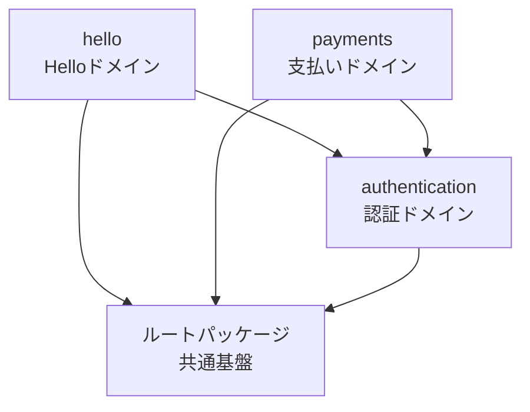

# Super Shiharai Kun

Rails 7.2 API application

## Architecture

このプロジェクトは**モジュラーモノリス**アーキテクチャを採用しています。

### モジュラーモノリスとは

モジュラーモノリスは、単一のアプリケーション内でドメインごとにモジュール（パッケージ）を分離する設計手法です。マイクロサービスの利点（独立性、保守性）とモノリスの利点（シンプルさ、パフォーマンス）を両立します。

### 主な特徴

- **ドメイン駆動設計**: ビジネスドメインごとにパッケージを分割
- **明確な依存関係**: Packwerkによる依存関係の可視化と強制
- **段階的な分離**: 将来的なマイクロサービス化を見据えた設計
- **テストの独立性**: パッケージ単位でのテストが可能

### ディレクトリ構造

```
app/
├── controllers/
│   ├── application_controller.rb    # 全コントローラーの基底クラス
│   └── concerns/                     # 共通コンサーン（最小限）
├── models/
│   └── concerns/                     # 共通モデルコンサーン
└── packages/                         # ドメインパッケージ
    ├── hello/                        # Helloドメイン（サンプル）
    │   ├── package.yml               # パッケージ設定
    │   ├── app/
    │   │   ├── controllers/
    │   │   │   └── hello_controller.rb  # 非公開（内部実装）
    │   │   └── public/               # 公開API（他パッケージから利用可能）
    │   │       └── .keep             # 最初は空でOK
    │   └── spec/
    │       └── requests/
    │           └── hello_spec.rb
    └── authentication/               # 認証ドメイン（計画中）
        ├── package.yml
        ├── app/
        │   ├── controllers/
        │   │   └── sessions_controller.rb  # 非公開
        │   ├── models/
        │   │   └── user.rb           # 非公開
        │   ├── services/
        │   │   └── authentication_service.rb  # 非公開
        │   └── public/               # 公開API
        │       └── authenticatable.rb  # 他パッケージから利用可能なconcern
        └── spec/
```

### パッケージ間の依存関係



**依存の方向性ルール:**
- 各ドメインパッケージはルートパッケージに依存できる
- 各ドメインパッケージは認証パッケージに依存できる
- **認証パッケージは他のドメインに依存してはいけない**（Packwerkが強制）
- **循環依存は禁止**（Packwerkが検出）

### 新しいパッケージの追加方法

1. **ディレクトリ構造を作成**

   ```bash
   mkdir -p app/packages/your_domain/app/controllers
   mkdir -p app/packages/your_domain/spec/requests
   ```

2. **package.ymlを作成**

   ```yaml
   # app/packages/your_domain/package.yml
   enforce_dependencies: true
   enforce_privacy: true

   dependencies:
     - "."                              # ルートパッケージ（ApplicationControllerなど）
     - "app/packages/authentication"    # 認証が必要な場合のみ追加

   # 公開APIのパス（デフォルト: app/public）
   # 他パッケージに公開したいクラス/モジュールのみをここに配置
   public_path: app/public
   ```

   **重要:**
   - `public_path: app/public` がデフォルト（他パッケージからはこのパス内のみアクセス可能）
   - `app/public/` 以外（controllers, models, services等）は全て非公開（private）
   - 他パッケージに公開したいものだけを `app/public/` に配置する

3. **コードを実装**

   ```ruby
   # app/packages/your_domain/app/controllers/your_controller.rb
   class YourController < ApplicationController
     include Authentication::Authenticatable  # 認証パッケージの公開APIを利用

     def index
       # 実装
     end
   end
   ```

   **公開APIが必要な場合:**

   ```ruby
   # app/packages/authentication/app/public/authenticatable.rb
   # 他パッケージから利用可能なconcern
   module Authentication
     module Authenticatable
       extend ActiveSupport::Concern

       included do
         before_action :authenticate_user!
       end

       private

       def authenticate_user!
         # 認証ロジック
       end
     end
   end
   ```

4. **依存関係をチェック**

   ```bash
   bundle exec packwerk check
   ```

### Packwerk - 依存関係管理ツール

[Packwerk](https://github.com/Shopify/packwerk)を使用してパッケージ間の依存関係を管理しています。

#### 主な機能

- **依存関係チェック**: 宣言されていない依存を検出
- **循環依存の検出**: パッケージ間の循環参照を防止
- **Privacy enforcement**: 公開API (`app/public/`) 以外への参照を検出
- **設定の検証**: `package.yml`の妥当性チェック

#### コマンド

```bash
# 設定の検証
bundle exec packwerk validate

# 依存関係違反をチェック
bundle exec packwerk check

# 特定のファイルのみチェック
bundle exec packwerk check app/packages/hello/
```

#### Git連携

Lefthookにより、コミット時に自動的にPackwerkチェックが実行されます:

```yaml
# .lefthook.yml（抜粋）
pre-commit:
  parallel: true
  commands:
    packwerk-validate:
      run: bundle exec packwerk validate
    packwerk-check:
      run: bundle exec packwerk check
```

### 設計原則

1. **単一責任の原則**: 各パッケージは1つのドメインのみを担当
2. **依存関係の明示**: `package.yml`で依存を宣言
3. **公開APIの最小化**: 必要最小限のクラス/モジュールのみ `app/public/` に配置
   - デフォルトは全て非公開（controllers, models, services等は他パッケージから参照不可）
   - 他パッケージが利用するべきものだけを `app/public/` に配置
   - 例: Adapter、DTO、Concern、Facade等
4. **テストの独立性**: パッケージごとに完結したテストを記述

### 将来の拡張性

このアーキテクチャにより、以下が容易になります:

- **新機能の追加**: 新しいパッケージとして独立して開発
- **チーム分割**: パッケージ単位でチームを分けて並行開発
- **マイクロサービス化**: 必要に応じてパッケージを別サービスに分離
- **段階的なリファクタリング**: パッケージ単位で改善

## Ruby version

* Ruby 3.x

## System dependencies

* Docker
* Docker Compose

## Setup

### Database

PostgreSQLをDockerで起動:

```bash
docker-compose up -d
```

### Database creation

```bash
rails db:create
```

### Database initialization

```bash
rails db:migrate
```

## How to run the server

```bash
rails s
```

## API docs (RSwag)

このプロジェクトでは、API仕様書の自動生成のために [RSwag](https://github.com/rswag/rswag) を使用しています。RSpecのリクエストスペックからSwagger/OpenAPI形式のドキュメントを生成することで、テストとドキュメントの同期を保ちます。

### Swagger UIへのアクセス

- Swagger UI: `http://localhost:3000/api-docs`
- 定義ファイル: `swagger/v1/swagger.yaml`

### 新しいAPIのドキュメント追加手順

1. **RSpecリクエストスペックを作成**

   `spec/requests/` 配下にrswag DSLを使ったテストを作成:

   ```ruby
   require 'swagger_helper'  # Swagger生成に必須

   RSpec.describe 'Hello API', type: :request do
     path '/hello_world' do  # → paths."/hello_world" (エンドポイント)
       get 'Returns hello world message' do  # → get.summary (HTTPメソッドと説明)
         tags 'Hello'  # → tags (Swagger UIでのグルーピング)
         produces 'application/json'  # → responses.content (レスポンス形式)

         response '200', 'successful' do  # → responses.'200'.description (ステータスコード)
           schema type: :object,  # → schema (レスポンスのデータ構造)
             properties: {
               message: { type: :string, example: 'hello world' }
             },
             required: ['message']

           run_test!  # 実際にAPIを呼び出してテスト実行（YAMLには影響しない）
         end
       end
     end
   end
   ```

   **DSLとYAMLの対応関係:**

   | DSL | 生成されるYAML |
   |-----|---------------|
   | `path '/hello_world'` | `paths:"/hello_world"` |
   | `get '説明'` | `get: summary: 説明` |
   | `tags 'Hello'` | `tags: [Hello]` |
   | `produces 'application/json'` | `content: application/json` |
   | `response '200', '説明'` | `responses: '200': description: 説明` |
   | `schema type: :object, properties: {...}` | `schema: type: object, properties: {...}` |
   | `run_test!` | YAML生成には影響せず、実際のテスト実行のみ |

2. **Swagger YAMLを生成**

   ```bash
   RAILS_ENV=test rake rswag:specs:swaggerize
   ```

3. **サーバーを再起動してSwagger UIで確認**

   ```bash
   rails s
   ```

   http://localhost:3000/api-docs にアクセス

### テスト実行

```bash
# 全てのRSpecテストを実行
bundle exec rspec

# 特定のスペックのみ実行
bundle exec rspec spec/requests/hello_spec.rb
```

### 注意事項

- **通常のRSpecテストとrswag用テストは共存可能**：`swagger_helper` をrequireしたテストのみがSwagger生成対象
- **テストとドキュメントが同期**：テストが通る = ドキュメントが正しい状態を保証
- **手動でYAMLを編集することも可能**：ただし次回の生成時に上書きされるため非推奨

## ログ出力

このプロジェクトでは、[SemanticLogger](https://github.com/rocketjob/semantic_logger)によるJSON形式の構造化ログを採用しています。

### 特徴

- **JSON形式**: 全環境でJSON形式で出力（Datadog、CloudWatch等のログ集約ツールに対応）
- **トレースID**: 全リクエストに`trace_id`が自動付与され、リクエストを横断した追跡が可能
- **モジュラーモノリス対応**: モジュールごとに独立したロガーを持てる

### トレースIDの仕様

- リクエストヘッダー`X-Trace-Id`で指定可能（マイクロサービス間の連携に有用）
- 未指定の場合はUUIDを自動生成
- レスポンスヘッダー`X-Trace-Id`で返却

```bash
# トレースIDを指定したリクエスト例
curl -H "X-Trace-Id: custom-trace-123" http://localhost:3000/up
```

### ログの出力例

```json
{
  "timestamp": "2025-10-07T13:09:06.459379Z",
  "level": "info",
  "application": "super-shiharai-kun",
  "environment": "development",
  "named_tags": {
    "trace_id": "682d608d-d8e7-45cc-abd8-a2b75d30c0bf"
  },
  "name": "Rack",
  "message": "Started",
  "payload": {
    "method": "GET",
    "path": "/up"
  }
}
```

## ヘルスチェック API

- エンドポイント: `GET /up`
- ハンドラ: Rails標準の `rails/health#show`
- 挙動: アプリケーションが例外なく起動できれば HTTP 200、失敗した場合は 500 を返すため、ロードバランサや監視サービスが認証なしで稼働状況を確認できます。
- 利用例:

  ```bash
  curl -if http://localhost:3000/up
  ```

  ステージングや本番環境では `localhost:3000` を適切なホスト名に置き換えて実行してください。

## Database configuration

* Host: localhost
* Port: 5432
* User: postgres
* Password: postgres
* Database: super_shiharai_kun_development

## Stop database

```bash
docker-compose down
```

## 静的解析と品質チェック

このプロジェクトでは、コード品質とセキュリティを保つために [Lefthook](https://github.com/evilmartians/lefthook) を使用した自動チェックを導入しています。

### 導入しているツール

- **RuboCop**: Rubyコードスタイルと品質チェック
  - ベース設定: [rubocop-rails-omakase](https://github.com/rails/rubocop-rails-omakase)
  - プラグイン: rubocop-rails, rubocop-performance, rubocop-rspec, rubocop-packs
  - 注: rubocop-sorbetがrubocop-rails-omakaseの間接依存として含まれるが、型アノテーションは使用しないためSorbet copは`.rubocop.yml`で無効化している
- **Brakeman**: セキュリティ脆弱性スキャナー
- **Bundler Audit**: 依存gemの既知の脆弱性チェック

### フックタイミングと実行内容

#### pre-commit（コミット前）

以下のチェックが並列実行されます:

```yaml
rubocop:            # 変更されたRubyファイルのスタイルチェック
packwerk-validate:  # Packwerk設定の検証
packwerk-check:     # パッケージ間の依存関係チェック
```

#### pre-push（プッシュ前）

```yaml
bundler-audit: # 依存関係の脆弱性チェック（最新の脆弱性DBに更新してチェック）
```

### 手動実行コマンド

Gitフックを待たずに手動で実行することも可能です:

```bash
# RuboCop（自動修正あり）
bundle exec rubocop -a

# RuboCop（自動修正なし）
bundle exec rubocop

# Packwerk検証
bundle exec packwerk validate

# Packwerk依存関係チェック
bundle exec packwerk check

# Brakeman
bundle exec brakeman

# Bundler Audit
bundle exec bundler-audit check --update
```

### Lefthookの管理コマンド

```bash
# フックのインストール
bundle exec lefthook install

# フックのアンインストール
bundle exec lefthook uninstall

# 特定のフックを手動実行
bundle exec lefthook run pre-commit --verbose
bundle exec lefthook run pre-push --verbose
```

### フックのスキップ

緊急時にフックをスキップする場合:

```bash
# コミット時のフックをスキップ
LEFTHOOK=0 git commit -m "message"

# プッシュ時のフックをスキップ
LEFTHOOK=0 git push
```

**注意**: セキュリティチェックをスキップする場合は、後で必ず手動実行してください。
