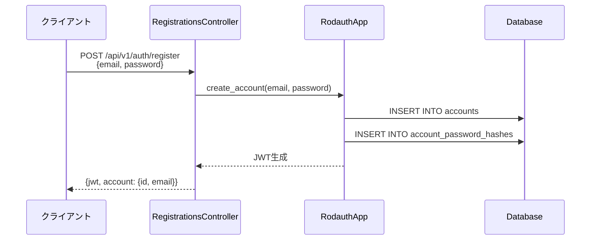
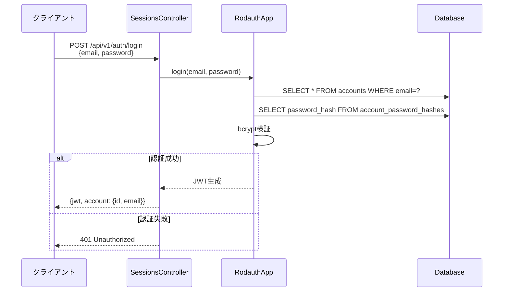
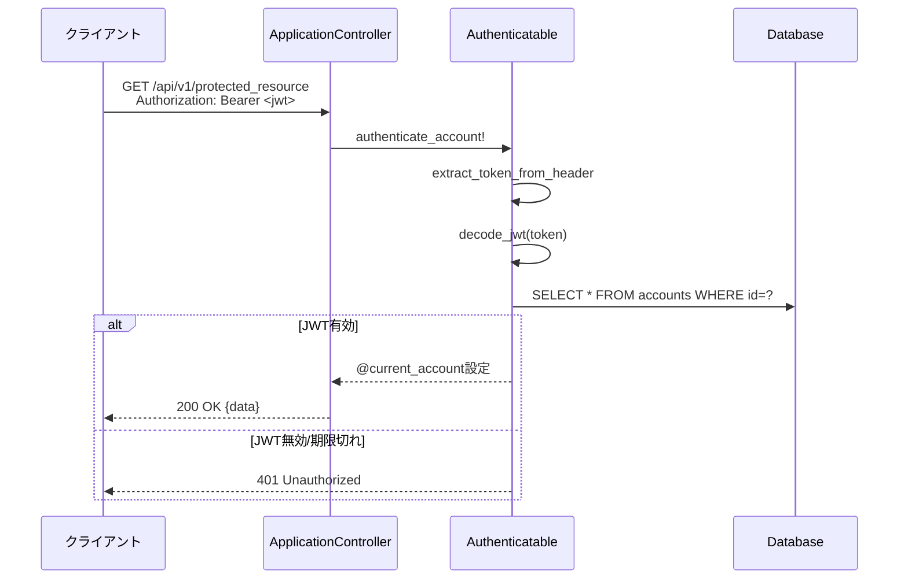

# 認証機能 要件定義

## 背景・目的

### 背景
- スーパー支払い君RBは企業向け支払い管理システムであり、法人ユーザーの認証基盤が必要
- 現時点で認証機能が存在せず、APIアクセスが無制限に可能な状態
- 将来的に請求書管理・支払い処理機能を実装する際、ユーザー単位のアクセス制御が必須

### 目的
- Rodauth + JWT によるステートレスな認証機能を実装
- ユーザー登録とログイン機能を提供
- 他パッケージから利用可能な認証基盤を構築
- モジュラーモノリスの原則に従い、`app/packages/authentication/` に独立したドメインとして配置

### Rodauth選定理由（BCrypt手動実装からの移行）

**背景:**
- 初期実装でBCryptを直接利用し、Fat Modelパターンで認証ロジックを実装していた
- しかし、本プロジェクトの重要ドメインは「請求管理」であり、認証は標準ライブラリで簡潔に実装すべき

**Rodauth採用のメリット:**
1. **コード量削減**: パスワードハッシュ管理、JWT発行、検証ロジックをフレームワークが提供
2. **セキュリティベストプラクティス**: bcryptコスト設定、ハッシュ保存方法、タイミング攻撃対策が組み込み済み
3. **将来の拡張性**: パスワードリセット、2FA、アカウントロック等の機能を追加設定のみで有効化可能
4. **Rails統合**: `rodauth-rails` gemによるActiveRecord互換性とRailsルーティング統合
5. **JWT標準対応**: `enable :jwt` で標準的なJWT認証が即座に利用可能

**移行方針:**
- 既存のマイグレーション（accounts, account_password_hashes）は再利用
- `Authentication::JwtService` は公開APIとして残し、内部でRodauthを利用
- エンドポイント仕様（`POST /api/v1/auth/register`, `POST /api/v1/auth/login`）は互換性を維持

## 現在の課題

- [ ] 認証機能が存在しない
- [ ] APIエンドポイントが無制限にアクセス可能
- [ ] ユーザー情報を管理するテーブルが存在しない
- [ ] JWT発行・検証の仕組みがない
- [ ] 他パッケージから利用可能な認証ヘルパーがない

## スコープ/非スコープ

### スコープ（今回実装）
- ✅ ユーザー登録（POST /api/v1/auth/register）
- ✅ ログイン（POST /api/v1/auth/login）
- ✅ JWT発行（HS256アルゴリズム）
- ✅ JWT検証ヘルパー（`authenticate_account!`）
- ✅ パスワードハッシュ化（bcrypt）
- ✅ メールアドレスバリデーション（形式・一意性）

### 非スコープ（将来対応）
- ❌ ログアウト機能（JWTはステートレスなので不要）
- ❌ トークンリフレッシュ
- ❌ パスワードリセット（メール送信）
- ❌ メール確認（Email Verification）
- ❌ 2要素認証（2FA）
- ❌ SSO連携（OAuth, SAML等）
- ❌ レート制限（Rack::Attack等）
- ❌ アカウントロック機能
- ❌ ログイン履歴管理

## 業務/ユーザーフロー

### ユーザー登録フロー

### ログインフロー

### 保護されたAPIアクセスフロー

## 非機能要件

### セキュリティ
- [ ] パスワードは平文でDBに保存しない（bcryptハッシュ化）
- [ ] JWT秘密鍵は環境変数管理（`JWT_SECRET_KEY`）
- [ ] JWT有効期限は1時間（3600秒）
- [ ] メールアドレスは小文字正規化して保存
- [ ] SQLインジェクション対策（Railsのパラメータ化クエリ）

### パフォーマンス
- [ ] JWT検証はステートレス（DBアクセス最小化）
- [ ] パスワードハッシュは別テーブル管理（Rodauth標準）
- [ ] emailカラムにuniqueインデックス

### 可用性
- [ ] 認証エラー時も統一的なJSONレスポンス
- [ ] `trace_id` を含めてログ追跡可能

### 拡張性
- [ ] 将来のトークンリフレッシュ対応を考慮した設計
- [ ] 他パッケージから利用可能な公開API設計

## ステークホルダー

| 役割 | 責務 |
|------|------|
| **アプリケーション開発者** | 認証機能を利用する他パッケージの実装 |
| **セキュリティエンジニア** | JWT秘密鍵管理、脆弱性対応 |
| **インフラエンジニア** | 環境変数設定、DB管理 |
| **QAエンジニア** | 認証フローの統合テスト |

## 観測指標

### 成功指標
- [ ] ユーザー登録成功率 > 95%
- [ ] ログイン成功率 > 98%（正しい認証情報の場合）
- [ ] JWT発行レスポンスタイム < 200ms (p95)

### モニタリング項目
- 登録API (`POST /api/v1/auth/register`) のレスポンスタイム・エラー率
- ログインAPI (`POST /api/v1/auth/login`) のレスポンスタイム・エラー率
- JWT検証失敗率（401エラー）
- パスワードハッシュ検証時間

## 参考資料

- [Rodauth Rails公式ドキュメント](https://github.com/janko/rodauth-rails)
- [JWT仕様 (RFC 7519)](https://datatracker.ietf.org/doc/html/rfc7519)
- [bcrypt仕様](https://github.com/bcrypt-ruby/bcrypt-ruby)
