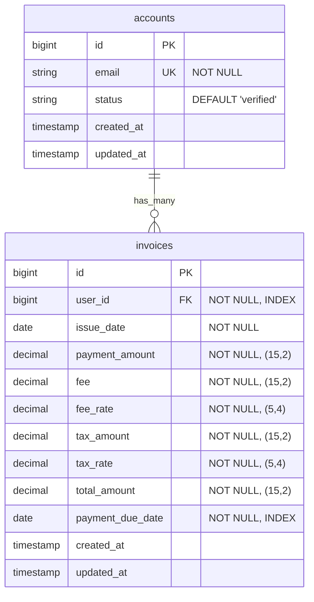
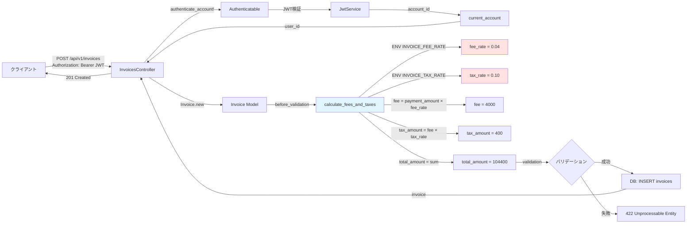
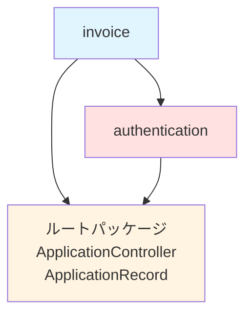
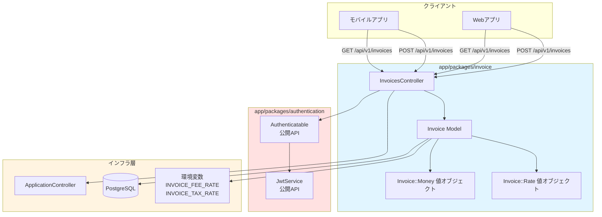

# 請求書管理機能 設計書

## 設計判断

### アーキテクチャ選定

| 項目 | 選定技術 | 理由 |
|------|---------|------|
| **パッケージ配置** | `app/packages/invoice/` | モジュラーモノリスの原則に従い独立ドメインとして配置 |
| **値オブジェクト** | ActiveRecord Attributes | Kotlinの `Money`, `Rate` をRuby/Railsで再現、型安全性を確保<br/>`Invoice::Money`, `Invoice::Rate` で名前空間衝突を回避 |
| **金額管理** | `decimal(15, 2)` | 浮動小数点誤差を回避、最大999兆円対応 |
| **料率管理** | `decimal(5, 4)` | 0.0001単位の精度（例: 0.0400 = 4%） |
| **手数料計算** | `before_validation` コールバック | Fat Model方針、バリデーション前に自動計算 |
| **認証** | `Authentication::Authenticatable` | 認証パッケージの公開APIを利用 |

### 重要な判断基準

1. **Fat Model, Skinny Controller方針の徹底**
   - ビジネスロジック（手数料計算）をモデル層に集約
   - Controller: パラメータ受け取り・エラーハンドリング・レスポンス整形のみ
   - Model: バリデーション・計算ロジック・永続化を管理

2. **値オブジェクトによる型安全性**
   - `Invoice::Money`: 金額を表す値オブジェクト（`BigDecimal` ラッパー）
   - `Invoice::Rate`: 料率を表す値オブジェクト（`BigDecimal` ラッパー）
   - ActiveRecord Attributesで自動シリアライズ/デシリアライズ
   - 演算メソッド（`Invoice::Money * Invoice::Rate`, `Invoice::Money + Invoice::Money`）を提供
   - **名前空間化の理由:** [money gem](https://github.com/RubyMoney/money) など他gemとの衝突を防ぐため

3. **Packwerk境界の尊重**
   - `invoice` パッケージは `authentication` パッケージに依存
   - `Authentication::Authenticatable` は公開API（`app/public/`）
   - `Account` モデルへの直接参照は外部キーのみ（リレーション未定義）

4. **環境変数による設定の柔軟性**
   - `INVOICE_FEE_RATE`: 手数料率（デフォルト: 0.04 = 4%）
   - `INVOICE_TAX_RATE`: 消費税率（デフォルト: 0.10 = 10%）
   - `.env` ファイルで環境ごとに設定変更可能

5. **将来拡張への考慮**
   - ステータスカラムは追加可能（現時点では未実装）
   - 支払い実行機能（`payment` パッケージ）との連携余地
   - PDF添付機能（ActiveStorage統合）は設計に含めるが未実装

## パッケージ構造案

```text
app/packages/invoice/
├── package.yml                           # Packwerk設定
├── app/
│   ├── controllers/
│   │   └── api/
│   │       └── v1/
│   │           └── invoices_controller.rb  # 請求書API（JWT認証必須）
│   ├── models/
│   │   ├── invoice.rb                      # 請求書モデル（Fat Model）
│   │   └── invoice/
│   │       ├── money.rb                    # 値オブジェクト（金額） - Invoice::Money
│   │       └── rate.rb                     # 値オブジェクト（料率） - Invoice::Rate
│   └── public/                             # 公開API（今回は未使用）
└── spec/
    ├── models/
    │   ├── invoice_spec.rb                 # ユニットテスト
    │   └── invoice/
    │       ├── money_spec.rb               # 値オブジェクトテスト
    │       └── rate_spec.rb                # 値オブジェクトテスト
    └── requests/
        └── api/
            └── v1/
                └── invoices_spec.rb        # リクエストスペック + RSwag
```

### package.yml

```yaml
enforce_dependencies: true
enforce_privacy: true

dependencies:
  - "."  # ルートパッケージ（ApplicationControllerなど）
  - "app/packages/authentication"  # JWT認証機能

public_path: app/public
```

## 主要クラス・ファイルの責務

### 1. Invoice (`app/models/invoice.rb`)

**責務:**

- 請求書データの永続化・バリデーション
- 手数料・税額・合計金額の自動計算（`before_validation` コールバック）
- 値オブジェクト（`Money`, `Rate`）の管理
- スコープメソッド提供（`between_payment_due_dates`）

**主要メソッド:**

```ruby
class Invoice < ApplicationRecord
  # ActiveRecord Attributes（値オブジェクト）
  attribute :payment_amount, Invoice::Money::Type.new
  attribute :fee, Invoice::Money::Type.new
  attribute :fee_rate, Invoice::Rate::Type.new
  attribute :tax_amount, Invoice::Money::Type.new
  attribute :tax_rate, Invoice::Rate::Type.new
  attribute :total_amount, Invoice::Money::Type.new

  # バリデーション
  validates :user_id, presence: true
  validates :issue_date, presence: true
  validates :payment_amount, presence: true
  validates :payment_due_date, presence: true
  validate :payment_due_date_after_issue_date
  validate :payment_amount_positive

  # コールバック
  before_validation :calculate_fees_and_taxes, if: :payment_amount_changed?

  # スコープ
  scope :between_payment_due_dates, ->(start_date, end_date) {
    where(payment_due_date: start_date..end_date)
  }

  private

  # 手数料・税額・合計金額を自動計算
  def calculate_fees_and_taxes
    self.fee_rate ||= Invoice::Rate.new(AppConfig.invoice_fee_rate)
    self.tax_rate ||= Invoice::Rate.new(AppConfig.invoice_tax_rate)

    self.fee = payment_amount * fee_rate.value
    self.tax_amount = fee * tax_rate.value
    self.total_amount = payment_amount + fee + tax_amount
  end

  def payment_due_date_after_issue_date
    return unless issue_date && payment_due_date

    if payment_due_date < issue_date
      errors.add(:payment_due_date, "must be on or after issue_date")
    end
  end

  def payment_amount_positive
    return unless payment_amount

    if payment_amount.value <= 0
      errors.add(:payment_amount, "must be greater than 0")
    end
  end
end
```

**カラム定義:**

- `id` (bigint, PK)
- `user_id` (bigint, FK → accounts.id, NOT NULL, INDEX)
- `issue_date` (date, NOT NULL)
- `payment_amount` (decimal(15, 2), NOT NULL)
- `fee` (decimal(15, 2), NOT NULL)
- `fee_rate` (decimal(5, 4), NOT NULL)
- `tax_amount` (decimal(15, 2), NOT NULL)
- `tax_rate` (decimal(5, 4), NOT NULL)
- `total_amount` (decimal(15, 2), NOT NULL)
- `payment_due_date` (date, NOT NULL, INDEX)
- `created_at` (timestamp, NOT NULL)
- `updated_at` (timestamp, NOT NULL)

### 2. Invoice::Money (`app/models/invoice/money.rb`)

**責務:**

- 金額を表す値オブジェクト
- `BigDecimal` による精度保証
- 演算メソッド提供（`+`, `-`, `*`）
- ActiveRecord Attributesとの統合
- **名前空間:** `Invoice::Money`（他gemとの衝突を防ぐため）

**実装例:**

```ruby
class Invoice::Money
  include Comparable

  attr_reader :value

  def initialize(value)
    @value = BigDecimal(value.to_s).round(2)
  end

  # 加算
  def +(other)
    Invoice::Money.new(@value + other.value)
  end

  # 減算
  def -(other)
    Invoice::Money.new(@value - other.value)
  end

  # 乗算（料率との掛け算）
  def *(rate)
    case rate
    when Invoice::Rate
      Invoice::Money.new(@value * rate.value)
    when Numeric
      Invoice::Money.new(@value * rate)
    else
      raise ArgumentError, "Cannot multiply Money by #{rate.class}"
    end
  end

  # 比較
  def <=>(other)
    @value <=> other.value
  end

  def to_s
    sprintf("%.2f", @value)
  end

  # ActiveRecord Attributes統合
  class Type < ActiveRecord::Type::Value
    def cast(value)
      case value
      when Invoice::Money
        value
      when Numeric, String
        Invoice::Money.new(value)
      else
        nil
      end
    end

    def serialize(value)
      value&.value
    end

    def deserialize(value)
      value ? Invoice::Money.new(value) : nil
    end
  end
end
```

### 3. Invoice::Rate (`app/models/invoice/rate.rb`)

**責務:**

- 料率（割合）を表す値オブジェクト
- `BigDecimal` による精度保証（小数点4桁）
- ActiveRecord Attributesとの統合
- **名前空間:** `Invoice::Rate`（他gemとの衝突を防ぐため）

**実装例:**

```ruby
class Invoice::Rate
  include Comparable

  attr_reader :value

  def initialize(value)
    @value = BigDecimal(value.to_s).round(4)
  end

  # 比較
  def <=>(other)
    @value <=> other.value
  end

  def to_s
    sprintf("%.4f", @value)
  end

  # パーセント表示（0.04 → "4.00"）
  def to_percent
    sprintf("%.2f", @value * 100)
  end

  # ActiveRecord Attributes統合
  class Type < ActiveRecord::Type::Value
    def cast(value)
      case value
      when Invoice::Rate
        value
      when Numeric, String
        Invoice::Rate.new(value)
      else
        nil
      end
    end

    def serialize(value)
      value&.value
    end

    def deserialize(value)
      value ? Invoice::Rate.new(value) : nil
    end
  end
end
```

### 4. Api::V1::InvoicesController

**エンドポイント:**

- `POST /api/v1/invoices` - 請求書登録
- `GET /api/v1/invoices` - 請求書一覧取得

**責務:**

- JWT認証（`before_action :authenticate_account!`）
- パラメータ受け取り・エラーハンドリング
- レスポンス整形（JSON）
- `current_account` からユーザーIDを取得

**実装例:**

```ruby
module Api
  module V1
    class InvoicesController < ApplicationController
      before_action :authenticate_account!

      # POST /api/v1/invoices
      def create
        invoice = Invoice.new(invoice_params.merge(user_id: current_account.id))

        if invoice.save
          render json: invoice_json(invoice), status: :created
        else
          render json: {
            error: {
              code: "INVOICE_CREATION_FAILED",
              message: invoice.errors.full_messages.join(", "),
              trace_id: trace_id
            }
          }, status: :unprocessable_entity
        end
      end

      # GET /api/v1/invoices
      def index
        invoices = Invoice.where(user_id: current_account.id)

        # 支払期限での期間検索
        if params[:start_date] && params[:end_date]
          invoices = invoices.between_payment_due_dates(
            Date.parse(params[:start_date]),
            Date.parse(params[:end_date])
          )
        end

        render json: { invoices: invoices.map { |i| invoice_json(i) } }
      end

      private

      def invoice_params
        params.permit(:issue_date, :payment_amount, :payment_due_date)
      end

      def invoice_json(invoice)
        {
          id: invoice.id,
          user_id: invoice.user_id,
          issue_date: invoice.issue_date.to_s,
          payment_amount: invoice.payment_amount.to_s,
          fee: invoice.fee.to_s,
          fee_rate: invoice.fee_rate.to_s,
          tax_amount: invoice.tax_amount.to_s,
          tax_rate: invoice.tax_rate.to_s,
          total_amount: invoice.total_amount.to_s,
          payment_due_date: invoice.payment_due_date.to_s,
          created_at: invoice.created_at.iso8601,
          updated_at: invoice.updated_at.iso8601
        }
      end

      def trace_id
        SemanticLogger.named_tags[:trace_id]
      end
    end
  end
end
```

**リクエスト例（POST /api/v1/invoices）:**

```json
{
  "issue_date": "2025-01-15",
  "payment_amount": "100000",
  "payment_due_date": "2025-02-28"
}
```

**レスポンス例（201 Created）:**

```json
{
  "id": 1,
  "user_id": 123,
  "issue_date": "2025-01-15",
  "payment_amount": "100000.00",
  "fee": "4000.00",
  "fee_rate": "0.0400",
  "tax_amount": "400.00",
  "tax_rate": "0.1000",
  "total_amount": "104400.00",
  "payment_due_date": "2025-02-28",
  "created_at": "2025-01-10T10:00:00+09:00",
  "updated_at": "2025-01-10T10:00:00+09:00"
}
```

**リクエスト例（GET /api/v1/invoices）:**

```http
GET /api/v1/invoices?start_date=2025-01-01&end_date=2025-01-31
Authorization: Bearer <JWT>
```

**レスポンス例（200 OK）:**

```json
{
  "invoices": [
    { /* Invoice object */ },
    { /* Invoice object */ }
  ]
}
```

## データモデル

### ER図



### テーブル定義

#### invoices

| カラム | 型 | 制約 | 説明 |
|--------|---|------|------|
| id | bigint | PK, AUTO_INCREMENT | 請求書ID |
| user_id | bigint | FK → accounts.id, NOT NULL, INDEX | ユーザーID（JWT認証） |
| issue_date | date | NOT NULL | 請求書発行日 |
| payment_amount | decimal(15, 2) | NOT NULL | 請求元への支払額 |
| fee | decimal(15, 2) | NOT NULL | 手数料（自動計算） |
| fee_rate | decimal(5, 4) | NOT NULL | 手数料率（環境変数） |
| tax_amount | decimal(15, 2) | NOT NULL | 消費税額（自動計算） |
| tax_rate | decimal(5, 4) | NOT NULL | 消費税率（環境変数） |
| total_amount | decimal(15, 2) | NOT NULL | 合計金額（自動計算） |
| payment_due_date | date | NOT NULL, INDEX | 支払期限 |
| created_at | timestamp | NOT NULL | 作成日時 |
| updated_at | timestamp | NOT NULL | 更新日時 |

**インデックス:**

- PRIMARY KEY: `id`
- INDEX: `user_id`
- INDEX: `payment_due_date`
- COMPOSITE INDEX: `(user_id, payment_due_date)` （将来追加検討）

**外部キー:**

- `user_id` → `accounts.id` (ON DELETE CASCADE)

**DB制約:**

- `CHECK (payment_amount > 0)`（PostgreSQL）

## 公開API・イベント

### 公開API（他パッケージ向け）

今回は公開APIなし（将来的に支払い実行機能で必要になる可能性）

### 内部API（非公開）

- `Api::V1::InvoicesController` → 外部公開（HTTP API）だがパッケージ内部実装
- `Invoice` モデル → パッケージ内部のみ
- `Money`, `Rate` → パッケージ内部のみ（将来的に共通化検討）

## データフロー

### 請求書登録フロー（手数料自動計算）



### 請求書一覧取得フロー（期間検索）

```mermaid
flowchart LR
    A[クライアント] -->|GET /api/v1/invoices?start_date&end_date<br/>Authorization: Bearer JWT| B[InvoicesController]
    B -->|authenticate_account!| C[Authenticatable]
    C -->|JWT検証| D[JwtService]
    D -->|account_id| E[current_account]
    E -->|user_id| B
    B -->|Invoice.where(user_id)| F[Invoice Model]
    F -->|between_payment_due_dates| G[Scope Query]
    G -->|SELECT * WHERE payment_due_date BETWEEN| H[DB: invoices]
    H -->|invoices| B
    B -->|200 OK| A

    style F fill:#e1f5ff
```

## Packwerk依存方針

### invoice パッケージの依存関係



**依存ルール:**

- ✅ `invoice` → ルートパッケージ（`.`）
- ✅ `invoice` → `authentication`（JWT認証機能）
- ❌ `invoice` → 他のドメインパッケージ（禁止）

**利用する公開API:**

- `Authentication::Authenticatable` → `before_action :authenticate_account!`
- `current_account` → `Account` インスタンス（`id`, `email` のみ参照）

## テスト戦略

### 1. ユニットテスト（Model層）

**対象:** `Invoice`, `Invoice::Money`, `Invoice::Rate`

**テストケース（Invoice）:**

- バリデーション
  - `user_id`, `issue_date`, `payment_amount`, `payment_due_date` 必須
  - `payment_due_date` は `issue_date` 以降
  - `payment_amount` は正の値のみ
- 手数料計算ロジック
  - デフォルト料率（4%, 10%）での計算
  - カスタム料率（環境変数）での計算
  - 境界値テスト（0円、1円、999兆円）
  - 丸め誤差の検証（小数点2桁で切り捨て）
- スコープメソッド
  - `between_payment_due_dates` の動作確認
  - 開始日・終了日の境界値テスト

**テストケース（Invoice::Money）:**

- 初期化（文字列、数値、BigDecimal）
- 演算（加算、減算、乗算）
- 比較（`<`, `>`, `==`）
- 丸め（小数点2桁）
- ActiveRecord Attributes統合

**テストケース（Invoice::Rate）:**

- 初期化（文字列、数値、BigDecimal）
- 比較（`<`, `>`, `==`）
- 丸め（小数点4桁）
- `to_percent` メソッド
- ActiveRecord Attributes統合

**ツール:**

- RSpec
- shoulda-matchers（バリデーションマッチャー）
- FactoryBot

**カバレッジ目標:** 100%

### 2. リクエストテスト（Controller層）

**対象:** `Api::V1::InvoicesController`

**テストケース:**

#### POST /api/v1/invoices

- ✅ 正常系: 請求書登録成功、手数料自動計算
- ✅ 正常系: カスタム料率での計算（環境変数）
- ❌ 異常系: JWT未提供（401）
- ❌ 異常系: 無効なJWT（401）
- ❌ 異常系: `payment_amount` 未入力（422）
- ❌ 異常系: `payment_amount` が負の値（422）
- ❌ 異常系: `payment_due_date` が `issue_date` より前（422）

#### GET /api/v1/invoices

- ✅ 正常系: 一覧取得（全件）
- ✅ 正常系: 期間検索（`start_date`, `end_date`）
- ✅ 正常系: 空配列返却（該当なし）
- ❌ 異常系: JWT未提供（401）
- ❌ 異常系: 他ユーザーの請求書が含まれない（アクセス制御）

**ツール:**

- RSpec Request Spec
- RSwag（OpenAPI仕様生成）

**カバレッジ目標:** 主要パス 100%

### 3. セキュリティテスト

**確認項目:**

- [ ] JWT認証が全APIで機能している
- [ ] `user_id` をパラメータで偽装できない
- [ ] 他ユーザーの請求書にアクセスできない
- [ ] SQLインジェクション対策（パラメータ化クエリ）

**ツール:**

- Brakeman（静的解析）
- Bundler Audit（gem脆弱性チェック）

### テスト実行コマンド

```bash
# ユニットテストのみ
bundle exec rspec app/packages/invoice/spec/models/
# または
bundle exec rspec app/packages/invoice/spec/models/invoice/

# リクエストテストのみ
bundle exec rspec app/packages/invoice/spec/requests/

# 全テスト
bundle exec rspec

# RSwag仕様生成
RAILS_ENV=test bundle exec rake rswag:specs:swaggerize
```

## リスク・代替案

### リスク1: 値オブジェクト（Money, Rate）の実装複雑度

**影響:** ActiveRecord Attributesとの統合が複雑、デバッグが困難

**対策:**

- ユニットテストで徹底的に検証
- `to_s` メソッドでデバッグ出力を充実
- Kotlinリファレンス実装を参考に実装

**代替案:**

- プリミティブ型（`BigDecimal`）のみ使用 → 型安全性低下、演算メソッドなし

### リスク2: 環境変数の設定ミス

**影響:** 手数料率が誤った値になる、計算エラー

**対策:**

- `.env.example` にデフォルト値とコメントを明記
- `ENV.fetch` でキー未設定時にエラー発生
- テストで環境変数を上書きして検証

**代替案:**

- DB設定テーブルで管理 → 今回はオーバーエンジニアリング

### リスク3: 手数料計算の丸め誤差

**影響:** 金額が1円ずれる可能性

**対策:**

- `BigDecimal` で計算、小数点2桁で丸め
- テストで境界値検証
- Kotlinリファレンス実装と同じロジック

### リスク4: 外部キー制約による削除カスケード

**影響:** アカウント削除時に請求書も削除される

**対策:**

- `ON DELETE CASCADE` を設定（仕様として許容）
- 将来的に論理削除（soft delete）を検討

**代替案:**

- `ON DELETE RESTRICT` → アカウント削除不可、運用が複雑化

### リスク5: ページネーションなし

**影響:** 大量データ時にレスポンスが遅延

**対策:**

- 初期リリースは許容範囲（1ユーザーあたり数百件想定）
- 将来的に `kaminari` や `pagy` で対応

**代替案:**

- 初期実装でページネーション → スコープ肥大化

## マイグレーションパス

### Phase 1: 基盤実装（今回）

- 請求書登録・一覧取得API
- 手数料自動計算
- 値オブジェクト（Money, Rate）
- JWT認証

### Phase 2: 検索機能拡張（将来）

- ページネーション
- ソート機能
- 複合検索（金額範囲、発行日等）

### Phase 3: ステータス管理（将来）

- ステータスカラム追加（未払い・支払済み等）
- ステータス遷移管理（状態マシン）

### Phase 4: 支払い実行機能（将来）

- `payment` パッケージとの連携
- 支払いステータス同期

### Phase 5: PDF管理（将来）

- ActiveStorage統合
- PDF生成・アップロード
- PDF一覧・ダウンロード

## 参考図

### コンポーネント図


