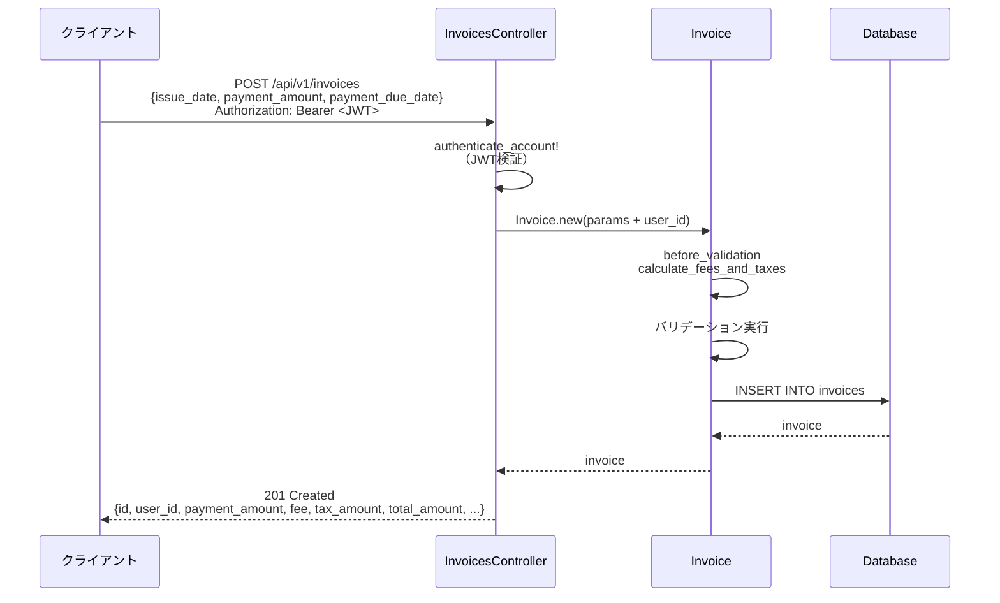
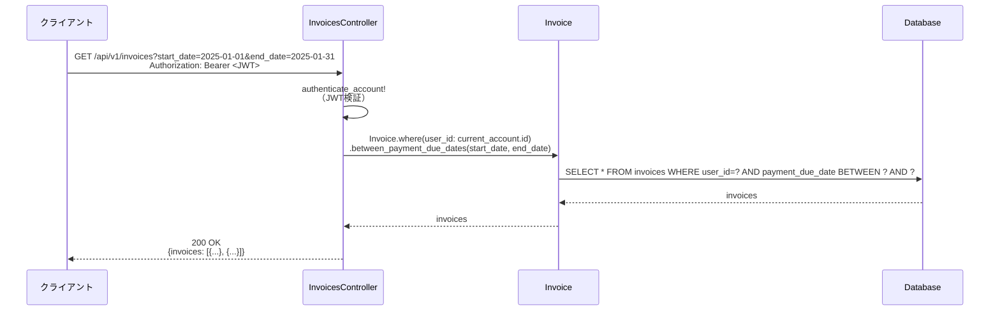

# 請求書管理機能 要件定義

## 背景・目的

### 背景

- 法人向け支払い代行サービスのバックエンドシステム
- 法人顧客が受け取った請求書（支払側）を電子化して管理する必要がある
- 支払い代行手数料を自動計算し、顧客に請求する仕組みが必要
- 認証機能（`authentication` パッケージ）が実装済みであり、ユーザー単位でのアクセス制御が可能

### 目的

- 請求書情報の登録・一覧取得機能を提供
- 支払額から手数料・税額・合計金額を自動計算
- JWT認証により、ユーザーごとの請求書管理を実現
- モジュラーモノリスの原則に従い、`app/packages/invoice/` に独立したドメインとして配置
- 将来的な支払い実行機能の基盤を構築

### 選定理由（Kotlinリファレンス実装からの移植）

- 参考実装: <https://github.com/gitkado/super-shiharai-kun>
- Kotlinの値オブジェクト（`Money`, `Rate`）をRails ActiveRecord Attributesで実装
- ビジネスロジック（手数料計算）をモデル層に集約（Fat Model方針）
- 環境変数による設定（`INVOICE_FEE_RATE`, `INVOICE_TAX_RATE`）で柔軟性を確保

## 現在の課題

- [ ] 請求書管理機能が存在しない
- [ ] 手数料計算ロジックが実装されていない
- [ ] 支払期限での期間検索ができない
- [ ] ユーザーごとの請求書管理が不可能
- [ ] PDF生成・アップロード機能が未実装（今回スコープ外）

## スコープ/非スコープ

### スコープ（今回実装）

- ✅ 請求書の登録（`POST /api/v1/invoices`）
  - `paymentAmount` のみ入力、他は自動計算
  - `issueDate`, `paymentDueDate` は手動入力
- ✅ 請求書の一覧取得（`GET /api/v1/invoices`）
  - 支払期限での期間検索（`start_date`, `end_date`）
  - JWT認証によるユーザーフィルタ
- ✅ 手数料・税額・合計金額の自動計算
  - 環境変数ベースの料率設定
- ✅ `Money`, `Rate` 値オブジェクトの実装
- ✅ JWT認証必須（全APIで `authenticate_account!`）

### 非スコープ（将来対応）

- ❌ 請求書の更新・削除API
- ❌ ステータス管理（全て支払確定済みの前提）
- ❌ 承認フロー（承認待ち・承認済み・却下等）
- ❌ PDF生成・アップロード機能
- ❌ 請求書の詳細取得API（`GET /api/v1/invoices/:id`）
- ❌ 請求書の検索機能（支払期限以外の条件）
- ❌ 支払い実行機能（別パッケージで将来実装）
- ❌ 支払い履歴管理
- ❌ 通知機能（支払期限リマインダー等）
- ❌ ページネーション（一覧取得は全件返却）

## 業務/ユーザーフロー

### 請求書登録フロー



**手数料計算ロジック（`before_validation` コールバック）:**

```ruby
def calculate_fees_and_taxes
  self.fee_rate ||= Rate.new(AppConfig.invoice_fee_rate)
  self.tax_rate ||= Rate.new(AppConfig.invoice_tax_rate)

  self.fee = payment_amount * fee_rate.value
  self.tax_amount = fee * tax_rate.value
  self.total_amount = payment_amount + fee + tax_amount
end
```

### 請求書一覧取得フロー



## 非機能要件

### セキュリティ

- [ ] JWT認証必須（全APIで `before_action :authenticate_account!`）
- [ ] ユーザーIDはJWTから取得（パラメータでの偽装を防止）
- [ ] 他ユーザーの請求書へのアクセス禁止（自動フィルタ）
- [ ] SQLインジェクション対策（Railsのパラメータ化クエリ）

### パフォーマンス

- [ ] インデックス設定（`user_id`, `payment_due_date`）
- [ ] N+1クエリ対策（Bulletで検出）
- [ ] 一覧取得は1クエリで完結（JOIN不要）

### データ整合性

- [ ] 金額フィールドは `decimal(15, 2)` で小数点管理
- [ ] 料率フィールドは `decimal(5, 4)` で精度確保（0.0400 = 4%）
- [ ] `user_id` 外部キー制約（`ON DELETE CASCADE`）
- [ ] `payment_amount` は正の値のみ（DB制約 + バリデーション）
- [ ] `payment_due_date` は `issue_date` 以降（バリデーション）

### 可用性

- [ ] エラー時も統一的なJSONレスポンス
- [ ] `trace_id` を含めてログ追跡可能
- [ ] バリデーションエラーは詳細なメッセージを返却

### 拡張性

- [ ] 将来的な支払い実行機能との連携を考慮
- [ ] ステータス管理を追加可能な設計（現時点では未実装）
- [ ] PDF生成機能を追加可能な設計（ActiveStorageとの統合余地）

## ステークホルダー

| 役割 | 責務 |
|------|------|
| **アプリケーション開発者** | 請求書管理機能の実装、テスト作成 |
| **ビジネスオーナー** | 手数料率・税率の設定、ビジネスルール定義 |
| **インフラエンジニア** | 環境変数設定、DB管理 |
| **QAエンジニア** | 手数料計算ロジックの検証、境界値テスト |
| **セキュリティエンジニア** | JWT認証フローの検証、アクセス制御確認 |

## 観測指標

### 成功指標

- [ ] 請求書登録成功率 > 95%
- [ ] 一覧取得レスポンスタイム < 500ms (p95)
- [ ] 手数料計算の正確性 = 100%（テストカバレッジ）
- [ ] ユーザーごとのアクセス制御漏れ = 0件

### モニタリング項目

- 請求書登録API (`POST /api/v1/invoices`) のレスポンスタイム・エラー率
- 一覧取得API (`GET /api/v1/invoices`) のレスポンスタイム・エラー率
- JWT検証失敗率（401エラー）
- 手数料計算エラー（500エラー、環境変数未設定等）
- DB接続エラー

## 参考資料

- [Kotlinリファレンス実装](https://github.com/gitkado/super-shiharai-kun)
- [ActiveRecord Attributes API](https://api.rubyonrails.org/classes/ActiveRecord/Attributes/ClassMethods.html)
- 本プロジェクトの認証パッケージ: `specs/authentication/`
