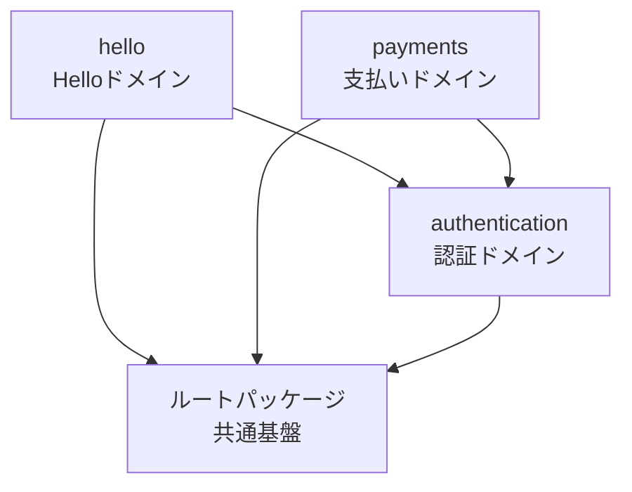

# モジュラーモノリスアーキテクチャ

このプロジェクトは**モジュラーモノリス**アーキテクチャを採用しています。

## 概要

モジュラーモノリスは、単一のアプリケーション内でドメインごとにモジュール（パッケージ）を分離する設計手法です。マイクロサービスの利点（独立性、保守性）とモノリスの利点（シンプルさ、パフォーマンス）を両立します。

## 主な特徴

- **ドメイン駆動設計**: ビジネスドメインごとにパッケージを分割
- **明確な依存関係**: Packwerkによる依存関係の可視化と強制
- **段階的な分離**: 将来的なマイクロサービス化を見据えた設計
- **テストの独立性**: パッケージ単位でのテストが可能

## ディレクトリ構造

### 全体構造

```text
app/
├── channels/                         # ActionCable（WebSocket）- 共通基盤のみ
│   └── application_cable/
├── controllers/                      # 共通基盤 - 基底クラスと技術的なconcernのみ
│   ├── application_controller.rb    # 全パッケージの基底クラス
│   └── concerns/                     # 全体で共有する技術的concern
├── jobs/                             # 共通基盤 - 基底クラスのみ
│   └── application_job.rb
├── mailers/                          # 共通基盤 - 基底クラスのみ
│   └── application_mailer.rb
├── middleware/                       # Rackミドルウェア（全体に影響）
│   └── request_trace_id.rb
├── models/                           # 共通基盤 - 基底クラスと技術的なconcernのみ
│   ├── application_record.rb        # 全パッケージの基底クラス
│   └── concerns/                     # 全体で共有する技術的concern
└── packages/                         # ビジネスロジック層（全てのドメイン機能）
    ├── hello/                        # Helloドメイン（サンプル）
    │   ├── package.yml               # パッケージ設定
    │   ├── app/
    │   │   ├── controllers/          # 非公開（内部実装）
    │   │   │   └── hello_controller.rb
    │   │   └── public/               # 公開API（他パッケージから利用可能）
    │   │       └── .keep             # 最初は空でOK
    │   └── spec/
    │       └── requests/
    │           └── hello_spec.rb
    └── authentication/               # 認証ドメイン（計画中）
        ├── package.yml
        ├── app/
        │   ├── controllers/          # 非公開
        │   │   └── sessions_controller.rb
        │   ├── models/               # 非公開（ビジネスロジックはここに）
        │   │   └── user.rb
        │   ├── jobs/                 # 非公開
        │   │   └── user_notification_job.rb
        │   └── public/               # 公開API
        │       └── authenticatable.rb  # 他パッケージから利用可能なconcern
        └── spec/
```

### 重要な原則

**app直下（共通基盤・インフラ層）:**

- ✅ 基底クラス（Application*）
- ✅ 全パッケージで共有する技術的な機能
- ✅ Rackミドルウェア
- ❌ ビジネスロジック → `app/packages/` へ

**app/packages/（ビジネスロジック層）:**

- ✅ 全てのドメイン固有のController, Model, Job, Mailer
- ✅ ビジネスルール、機能実装
- ✅ Railsの標準構成（MVC）に従う
- ✅ Fat Model, Skinny Controller

**公開APIの方針:**

- デフォルトは全て非公開（packages内のapp/配下）
- 他パッケージから利用されるものだけ `app/public/` に配置

## パッケージ間の依存関係



**依存の方向性ルール:**

- 各ドメインパッケージはルートパッケージに依存できる
- 各ドメインパッケージは認証パッケージに依存できる
- **認証パッケージは他のドメインに依存してはいけない**（Packwerkが強制）
- **循環依存は禁止**（Packwerkが検出）

## 新しいパッケージの追加方法

### 1. ディレクトリ構造を作成

```bash
mkdir -p app/packages/your_domain/app/controllers
mkdir -p app/packages/your_domain/spec/requests
```

### 2. package.ymlを作成

```yaml
# app/packages/your_domain/package.yml
enforce_dependencies: true
enforce_privacy: true

dependencies:
  - "."                              # ルートパッケージ（ApplicationControllerなど）
  - "app/packages/authentication"    # 認証が必要な場合のみ追加

# 公開APIのパス（デフォルト: app/public）
# 他パッケージに公開したいクラス/モジュールのみをここに配置
public_path: app/public
```

**重要:**

- `public_path: app/public` がデフォルト（他パッケージからはこのパス内のみアクセス可能）
- `app/public/` 以外（controllers, models, services等）は全て非公開（private）
- 他パッケージに公開したいものだけを `app/public/` に配置する

### 3. コードを実装

```ruby
# app/packages/your_domain/app/controllers/your_controller.rb
class YourController < ApplicationController
  include Authentication::Authenticatable  # 認証パッケージの公開APIを利用

  def index
    # 実装
  end
end
```

**公開APIが必要な場合:**

```ruby
# app/packages/authentication/app/public/authenticatable.rb
# 他パッケージから利用可能なconcern
module Authentication
  module Authenticatable
    extend ActiveSupport::Concern

    included do
      before_action :authenticate_user!
    end

    private

    def authenticate_user!
      # 認証ロジック
    end
  end
end
```

### 4. 依存関係をチェック

```bash
bundle exec packwerk check
```

詳細は [Packwerk使用ガイド](packwerk_guide.md) を参照してください。

## 設計原則

1. **単一責任の原則**: 各パッケージは1つのドメインのみを担当
2. **依存関係の明示**: `package.yml`で依存を宣言
3. **公開APIの最小化**: 必要最小限のクラス/モジュールのみ `app/public/` に配置
   - デフォルトは全て非公開（controllers, models, services等は他パッケージから参照不可）
   - 他パッケージが利用するべきものだけを `app/public/` に配置
   - 例: Adapter、DTO、Concern、Facade等
4. **テストの独立性**: パッケージごとに完結したテストを記述

## 将来の拡張性

このアーキテクチャにより、以下が容易になります:

- **新機能の追加**: 新しいパッケージとして独立して開発
- **チーム分割**: パッケージ単位でチームを分けて並行開発
- **マイクロサービス化**: 必要に応じてパッケージを別サービスに分離
- **段階的なリファクタリング**: パッケージ単位で改善

## 関連ドキュメント

- [Packwerk使用ガイド](packwerk_guide.md)
- [エラーハンドリング](error_handling.md)
- [ログとトレーシング](logging_tracing.md)
