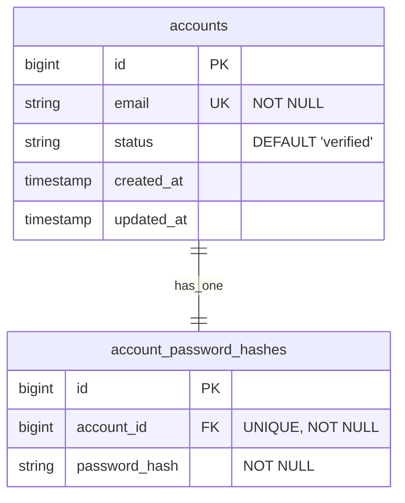
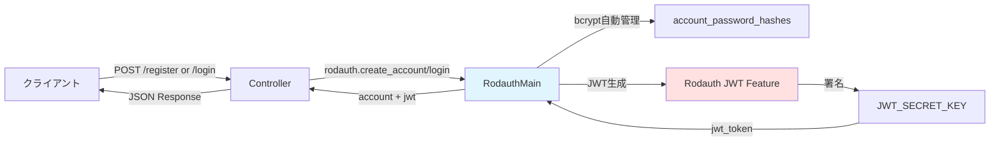
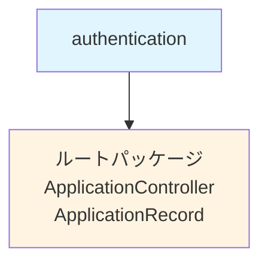
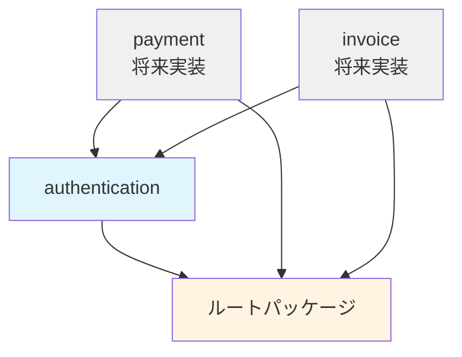
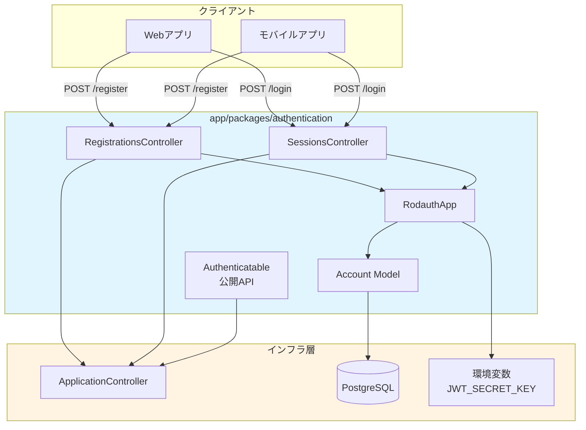

# 認証機能 設計書

## 設計判断

### アーキテクチャ選定

| 項目 | 選定技術 | 理由 |
|------|---------|------|
| **認証ライブラリ** | Rodauth (rodauth-rails) | セキュリティベストプラクティス組み込み、JWT標準対応、拡張性が高い |
| **トークン方式** | JWT (HS256) via Rodauth | ステートレス認証、APIモードに最適 |
| **パスワードハッシュ** | bcrypt (Rodauth管理) | 業界標準、Rodauthが自動管理 |
| **パッケージ配置** | `app/packages/authentication/` | モジュラーモノリスの原則に従い独立ドメインとして配置 |

**設計判断の変更履歴:**

1. **フェーズ1 (2025-10-21〜23): BCrypt直接利用**
   - Fat Modelパターンで `Account.register`, `account.authenticate` を実装
   - JwtServiceを公開API化
   - 理由: シンプルな実装、学習コストが低い

2. **フェーズ2 (2025-10-24): Rodauthへ移行（本設計）**
   - 理由:
     - 本プロジェクトの重要ドメインは「請求管理」であり、認証はライブラリに任せるべき
     - セキュリティベストプラクティス（bcryptコスト、タイミング攻撃対策）が組み込み済み
     - 将来の拡張（パスワードリセット、2FA等）を設定のみで有効化可能
     - コード量削減（約60%削減見込み）
   - 移行方針:
     - 既存マイグレーションは再利用
     - エンドポイント仕様は互換性維持
     - `Authentication::JwtService` は内部でRodauthを利用するラッパーとして残す

### 重要な判断基準

1. **Rodauth標準機能の最大活用**
   - 初期リリースは `create_account`, `login`, `jwt` 機能のみ有効化
   - 将来的な拡張（パスワードリセット、2FA等）は設定追加のみで実現
   - カスタムロジックは最小限に抑え、Rodauthの規約に従う

2. **ステートレス認証**
   - JWTのみ使用、セッションストアは使用しない
   - ログアウト機能は不要（クライアント側でトークン破棄）
   - Rodauth JWT機能が自動的にトークン生成・検証を管理

3. **Packwerk境界の尊重**
   - 他パッケージから利用される機能は `app/public/` に配置
   - 内部実装（Controller, Model等）は非公開
   - RodauthアプリケーションはPackage内部（`app/misc/`）に配置

4. **Fat Model, Skinny Controllerからの脱却**
   - **Rodauth移行により方針変更**
   - 認証ロジックはRodauthフレームワークに委譲
   - Controller: 薄いラッパー（エラーハンドリング・レスポンス整形のみ）
   - Model: バリデーション・正規化のみ（ビジネスロジック削除）

5. **テスト戦略**
   - モデル層: バリデーション・正規化のみテスト（ユニットテスト）
   - API層: エンドポイント動作とエラーハンドリングを検証（リクエストスペック）
   - Rodauth機能: フレームワーク側でテスト済みと仮定
   - RSwagでOpenAPI仕様を自動生成

## パッケージ構造案

```
app/packages/authentication/
├── package.yml                           # Packwerk設定
├── app/
│   ├── controllers/
│   │   └── authentication/
│   │       ├── registrations_controller.rb  # ユーザー登録（薄いラッパー）
│   │       └── sessions_controller.rb       # ログイン（薄いラッパー）
│   ├── models/
│   │   └── account.rb                       # ユーザーモデル（最小構成）
│   ├── misc/                                 # Rodauthアプリケーション配置
│   │   ├── rodauth_main.rb                  # Rodauth設定クラス
│   │   └── rodauth_app.rb                   # Rodauthエントリーポイント
│   └── public/                               # 公開API
│       └── authentication/
│           ├── jwt_service.rb               # JWT生成・検証（Rodauthラッパー）
│           └── authenticatable.rb           # 認証concern（他パッケージ向け）
└── spec/
    ├── models/
    │   └── account_spec.rb                   # ユニットテスト
    └── requests/
        └── authentication/
            ├── registrations_spec.rb         # 登録APIテスト
            └── sessions_spec.rb              # ログインAPIテスト
```

**Rodauth統合のポイント:**
- `app/misc/rodauth_main.rb`: Rodauth設定クラス（JWT有効化、テーブル名指定等）
- `app/misc/rodauth_app.rb`: Roda::Railsアプリケーション（Rodauthエンドポイント公開）
- Controller: Rodauthの機能を呼び出す薄いラッパー（エラーハンドリング・レスポンス整形のみ）
- JwtService: 他パッケージからの利用を考慮し、公開APIとして維持（内部でRodauth利用）

### package.yml

```yaml
enforce_dependencies: true
enforce_privacy: true

dependencies:
  - "."  # ルートパッケージ（ApplicationController, ApplicationRecord等）

public_path: app/public
```

## 主要クラス・ファイルの責務

### 1. RodauthMain (`app/misc/rodauth_main.rb`)

**責務:**
- Rodauthの設定クラス（JWT有効化、テーブル名指定等）
- パスワードハッシュ管理、JWT生成ロジックをRodauthに委譲

**主要設定:**
```ruby
class RodauthMain < Rodauth::Rails::Auth
  configure do
    # 機能有効化
    enable :create_account, :login, :logout, :jwt

    # JWT設定
    jwt_secret ENV.fetch("JWT_SECRET_KEY")

    # テーブル・カラム設定
    accounts_table :accounts
    account_password_hash_column :password_hash

    # ステータスカラム設定
    account_status_column :status

    # ログインID設定
    login_column :email
    login_param "email"

    # JSON APIモード
    only_json? true

    # JWT有効期限（1時間）
    max_session_lifetime 3600
  end
end
```

### 2. RodauthApp (`app/misc/rodauth_app.rb`)

**責務:**
- Rodauthエンドポイントを公開するRodaアプリケーション
- Railsルーティングとの統合

**実装例:**
```ruby
class RodauthApp < Rodauth::Rails::App
  configure RodauthMain

  route do |r|
    r.rodauth # Rodauthエンドポイントを有効化
  end
end
```

### 3. Authentication::JwtService (`app/public/authentication/jwt_service.rb`)

**責務:**
- JWT生成・検証ロジック（公開API）
- 他パッケージから利用可能
- **内部でRodauthを利用**（BCrypt直接利用から変更）

**主要メソッド:**
```ruby
module Authentication
  module JwtService
    class << self
      # JWT生成（Rodauthラッパー）
      def generate(account, expires_in: 1.hour)
        # Rodauthインスタンスを取得してJWT生成
        rodauth = rodauth_instance(account)
        rodauth.session_jwt
      end

      # JWTデコード（Rodauth JWT検証を利用）
      def decode(token)
        rodauth = rodauth_instance
        rodauth.jwt_decode(token)
      rescue Rodauth::JWTExpired, Rodauth::JWTInvalid
        nil
      end

      private

      def rodauth_instance(account = nil)
        # Rodauthインスタンスを生成
        RodauthMain.new(account: account)
      end
    end
  end
end
```

### 4. Account (`app/models/account.rb`)

**責務:**
- ユーザー情報管理（最小構成）
- メールアドレスバリデーション
- メール正規化（小文字変換）
- アカウントステータス管理（Enum）
- **パスワード管理はRodauthに委譲**（BCrypt直接利用から変更）

**Enum定義:**
```ruby
enum status: {
  unverified: "unverified", # メール未確認
  verified: "verified",     # メール確認済み（デフォルト）
  locked: "locked",         # アカウントロック
  closed: "closed"          # アカウント閉鎖
}, _prefix: true
```

**利用可能なメソッド:**
- `account.status_verified?` / `account.status_locked?` など
- `account.status_verified!` / `account.status_locked!` など（更新+保存）
- `Account.status_verified` / `Account.status_locked` など（スコープ）

**バリデーション:**
- `email`: 必須、メール形式、一意性（大文字小文字区別なし）
- `status`: デフォルト "verified"（メール確認スキップ）、Enumで型安全性確保

**コールバック:**
- `before_validation :normalize_email` → 小文字・trim処理

**Rodauth統合後の変更点:**
- ❌ 削除: `Account.register`, `account.set_password`, `account.authenticate` メソッド
- ✅ 簡素化: ActiveRecordの標準機能のみ使用
- ✅ Rodauthが自動的に `account_password_hashes` テーブルを管理

### 5. Authentication::RegistrationsController

**エンドポイント:** `POST /api/v1/auth/register`

**責務:**
- Rodauthのアカウント作成機能を呼び出す薄いラッパー
- エラーハンドリング・レスポンス整形

**実装例:**
```ruby
module Authentication
  class RegistrationsController < ApplicationController
    def create
      # Rodauthのアカウント作成を呼び出し
      account = rodauth.create_account(
        login: params[:email],
        password: params[:password]
      )

      # JWT発行（Rodauth管理）
      jwt = rodauth.session_jwt

      render json: {
        jwt: jwt,
        account: { id: account.id, email: account.email }
      }, status: :created
    rescue Rodauth::CreateAccountError => e
      render json: {
        error: {
          code: "REGISTRATION_FAILED",
          message: e.message,
          trace_id: request.trace_id
        }
      }, status: :unprocessable_entity
    end
  end
end
```

**リクエスト:**
```json
{
  "email": "user@example.com",
  "password": "secure_password123"
}
```

**レスポンス（成功）:**
```json
{
  "jwt": "eyJhbGciOiJIUzI1NiIsInR5cCI6IkpXVCJ9...",
  "account": {
    "id": 1,
    "email": "user@example.com"
  }
}
```

**レスポンス（失敗）:**
```json
{
  "error": {
    "code": "REGISTRATION_FAILED",
    "message": "Email has already been taken",
    "trace_id": "682d608d-d8e7-45cc-abd8-a2b75d30c0bf"
  }
}
```

### 6. Authentication::SessionsController

**エンドポイント:** `POST /api/v1/auth/login`

**責務:**
- Rodauthのログイン機能を呼び出す薄いラッパー
- エラーハンドリング・レスポンス整形

**実装例:**
```ruby
module Authentication
  class SessionsController < ApplicationController
    def create
      # Rodauthログイン認証
      account = rodauth.login(
        login: params[:email],
        password: params[:password]
      )

      # JWT発行
      jwt = rodauth.session_jwt

      render json: {
        jwt: jwt,
        account: { id: account.id, email: account.email }
      }, status: :ok
    rescue Rodauth::LoginError
      render json: {
        error: {
          code: "LOGIN_FAILED",
          message: "Invalid email or password",
          trace_id: request.trace_id
        }
      }, status: :unauthorized
    end
  end
end
```

**リクエスト:**
```json
{
  "email": "user@example.com",
  "password": "secure_password123"
}
```

**レスポンス（成功）:** RegistrationsControllerと同じ

**レスポンス（失敗）:**
```json
{
  "error": {
    "code": "LOGIN_FAILED",
    "message": "Invalid email or password",
    "trace_id": "682d608d-d8e7-45cc-abd8-a2b75d30c0bf"
  }
}
```

### 7. Authentication::Authenticatable (`app/public/authentication/authenticatable.rb`)

**責務:**
- 他パッケージから利用可能な認証ヘルパー
- JWT検証・デコード（**Rodauth利用**）
- `current_account` 提供

**公開メソッド:**
```ruby
module Authentication::Authenticatable
  extend ActiveSupport::Concern

  included do
    attr_reader :current_account
  end

  private

  # before_action :authenticate_account! で使用
  def authenticate_account!
    token = extract_token_from_header
    return unauthorized_response unless token

    # Rodauth JWT検証を利用
    payload = Authentication::JwtService.decode(token)
    @current_account = Account.find_by(id: payload["account_id"])

    unauthorized_response unless @current_account
  rescue StandardError
    unauthorized_response
  end

  def extract_token_from_header
    header = request.headers["Authorization"]
    header&.split(" ")&.last if header&.start_with?("Bearer ")
  end

  def unauthorized_response
    render json: {
      error: {
        code: "UNAUTHORIZED",
        message: "Invalid or expired token",
        trace_id: request.trace_id
      }
    }, status: :unauthorized

    false  # before_actionチェーンを停止
  end
end
```

**使用例（他パッケージ）:**
```ruby
# app/packages/payment/app/controllers/payment/invoices_controller.rb
class Payment::InvoicesController < ApplicationController
  before_action :authenticate_account!

  def index
    # current_account が利用可能
    invoices = current_account.invoices
    render json: invoices
  end
end
```

## データモデル

### ER図



### テーブル定義

#### accounts

| カラム | 型 | 制約 | 説明 |
|--------|---|------|------|
| id | bigint | PK, AUTO_INCREMENT | アカウントID |
| email | string | NOT NULL, UNIQUE | メールアドレス（小文字正規化済み） |
| status | string | NOT NULL, DEFAULT 'verified' | アカウントステータス（今回は固定） |
| created_at | timestamp | NOT NULL | 作成日時 |
| updated_at | timestamp | NOT NULL | 更新日時 |

**インデックス:**
- PRIMARY KEY: `id`
- UNIQUE INDEX: `email`

#### account_password_hashes

| カラム | 型 | 制約 | 説明 |
|--------|---|------|------|
| id | bigint | PK, AUTO_INCREMENT | ID |
| account_id | bigint | FK → accounts.id, UNIQUE, NOT NULL | アカウントID |
| password_hash | string | NOT NULL | bcryptハッシュ |

**インデックス:**
- PRIMARY KEY: `id`
- UNIQUE INDEX: `account_id`

**外部キー:**
- `account_id` → `accounts.id` (ON DELETE CASCADE)

## 公開API・イベント

### 公開API（他パッケージ向け）

| モジュール/クラス | 配置 | 公開メソッド | 用途 |
|------------------|------|-------------|------|
| `Authentication::Authenticatable` | `app/public/authentication/authenticatable.rb` | `authenticate_account!`<br/>`current_account` | Controllerに includeして認証機能を提供 |

### 内部API（非公開）

- `Authentication::RegistrationsController` → 外部公開（HTTP API）だがパッケージ内部実装
- `Authentication::SessionsController` → 同上
- `Account` モデル → パッケージ内部のみ
- `RodauthApp` → パッケージ内部のみ

## データフロー

### JWT発行フロー（Rodauth統合版）



**重要な変更点:**
- `RodauthMain`: Rodauth設定クラスが認証ロジックを完全管理
- bcryptコスト、ハッシュ保存、JWT生成を全てRodauthが自動処理
- Controllerはエラーハンドリングとレスポンス整形のみ

### JWT検証フロー（Rodauth統合版）

```mermaid
flowchart LR
    A[クライアント] -->|Authorization: Bearer <jwt>| B[Controller]
    B -->|authenticate_account!| C[Authenticatable]
    C -->|extract_token| D[Request Header]
    C -->|JwtService.decode| E[RodauthMain]
    E -->|rodauth.jwt_decode| F[JWT_SECRET_KEY]
    F -->|payload| E
    E -->|account_id| G[DB: accounts]
    G -->|@current_account| B
    B -->|処理継続| H[Business Logic]

    style E fill:#e1f5ff
```

**重要な変更点:**
- `JwtService.decode`: 内部でRodauth JWT検証を利用
- タイミング攻撃対策、署名検証をRodauthが自動実施
- トークン有効期限チェックもRodauth管理

## Packwerk依存方針

### authentication パッケージの依存関係



**依存ルール:**
- ✅ `authentication` → ルートパッケージ（`.`）
- ❌ `authentication` → 他のドメインパッケージ（禁止）

### 他パッケージからの依存



**将来の他パッケージからの利用:**

```yaml
# app/packages/payment/package.yml
enforce_dependencies: true
enforce_privacy: true

dependencies:
  - "."
  - "app/packages/authentication"  # 追加
```

## テスト戦略

### 1. ユニットテスト（Model層）

**対象:** `Account` モデル

**テストケース:**
- バリデーション
  - email: 必須、メール形式、一意性
  - 大文字小文字を区別しない一意性
- 正規化ロジック
  - メールアドレスが小文字に変換される
  - 前後の空白がトリムされる
- 境界値テスト
  - 空文字、nil、長いメールアドレス
  - 無効なメール形式（`@なし`、`ドメインなし`等）

**ツール:**
- RSpec
- shoulda-matchers（バリデーションマッチャー）
- FactoryBot

**カバレッジ目標:** 100%

### 2. リクエストテスト（Controller層）

**対象:** RegistrationsController, SessionsController

**テストケース（最小限）:**

#### POST /api/v1/auth/register
- ✅ 正常系: 登録成功、JWTが返却される
- ❌ 異常系: メールアドレス重複（422）
- ❌ 異常系: 無効なメール形式（422）
- ❌ 異常系: パスワード未入力（422）

#### POST /api/v1/auth/login
- ✅ 正常系: ログイン成功、JWTが返却される
- ❌ 異常系: 未登録メールアドレス（401）
- ❌ 異常系: パスワード誤り（401）

#### 保護されたエンドポイント（サンプル）
- ✅ 正常系: 有効なJWTでアクセス成功
- ❌ 異常系: JWTなし（401）
- ❌ 異常系: 無効なJWT（401）
- ❌ 異常系: 期限切れJWT（401）

**ツール:**
- RSpec Request Spec
- RSwag（OpenAPI仕様生成）

**カバレッジ目標:** 主要パス 100%

### 3. セキュリティテスト

**確認項目:**
- [ ] パスワードが平文でDBに保存されない（bcrypt確認）
- [ ] JWT秘密鍵が環境変数管理されている
- [ ] ログイン失敗時にアカウント存在を推測できない（メッセージ統一）
- [ ] SQLインジェクション対策（パラメータ化クエリ）

**ツール:**
- Brakeman（静的解析）
- Bundler Audit（gem脆弱性チェック）

### テスト実行コマンド

```bash
# ユニットテストのみ
bundle exec rspec spec/models/account_spec.rb

# リクエストテストのみ
bundle exec rspec spec/requests/authentication/

# 全テスト
bundle exec rspec

# RSwag仕様生成
RAILS_ENV=test bundle exec rake rswag:specs:swaggerize
```

## リスク・代替案

### リスク1: Rodauthへの移行コスト

**影響:** 既存のBCrypt実装からの移行に工数がかかる

**対策:**
- エンドポイント仕様を互換性維持し、クライアント影響を最小化
- 既存テストを最大限再利用
- `Authentication::JwtService` 公開APIを維持し、他パッケージへの影響なし

**代替案:**
- BCrypt実装を維持 → 将来の拡張時に大幅な修正が必要、セキュリティリスク

### リスク2: JWT秘密鍵の漏洩

**影響:** 全てのトークンが偽造可能になる

**対策:**
- 環境変数で管理（`.env` はGit管理外）
- Rodauthが推奨する秘密鍵生成方法を採用
- 本番環境では定期的にローテーション
- 将来的にRS256（公開鍵暗号）への移行を検討

### リスク3: トークンリフレッシュなし

**影響:** 有効期限（1時間）後に再ログインが必要

**対策:**
- 初期リリースは許容範囲
- Rodauthの `refresh_token` 機能を設定追加のみで有効化可能

**代替案:**
- 有効期限を長くする（24時間等） → セキュリティリスク増加

### リスク4: ログイン失敗時のブルートフォース攻撃

**影響:** 総当たり攻撃でパスワード破られる可能性

**対策（将来対応）:**
- Rack::Attackによるレート制限
- Rodauthの `lockout` 機能を有効化（設定のみ）
- Rodauth標準でタイミング攻撃対策が実装済み

### リスク5: Rodauthの学習コスト

**影響:** チームメンバーがRodauthに不慣れな場合、メンテナンスが困難

**対策:**
- Rodauthの公式ドキュメントを参照資料として整備
- 薄いラッパー（Controller, JwtService）を維持し、Rodauth依存を局所化
- 設定クラス（RodauthMain）にコメントを充実させる

**代替案:**
- BCrypt実装を維持 → セキュリティベストプラクティスの実装負荷が増加

## マイグレーションパス

### Phase 1: BCrypt手動実装（✅ 完了 - 2025-10-23）
- ユーザー登録・ログイン
- JWT発行・検証（BCrypt直接利用）
- Fat Modelパターン

### Phase 2: Rodauth移行（🔄 計画中 - 2025-10-24）
- Rodauth + JWT統合
- 認証ロジックのフレームワーク委譲
- コード量削減（約60%削減見込み）
- エンドポイント仕様は互換性維持

### Phase 3: セキュリティ強化（将来）
- レート制限（Rack::Attack）
- アカウントロック機能（`enable :lockout`）
- ログイン履歴管理（`enable :audit_logging`）

### Phase 4: 利便性向上（将来）
- トークンリフレッシュ（`enable :refresh_token`）
- パスワードリセット（`enable :reset_password`）
- メール確認機能（`enable :verify_account`）

### Phase 5: エンタープライズ対応（将来）
- SSO連携（OAuth, SAML）
- 2要素認証（`enable :otp`, `enable :webauthn`）
- 監査ログ強化

**Rodauth移行のメリット:**
- Phase 3〜5の機能は設定追加のみで有効化可能
- セキュリティベストプラクティスが組み込み済み
- 認証ドメインの保守コストを大幅削減

## 参考図

### コンポーネント図


