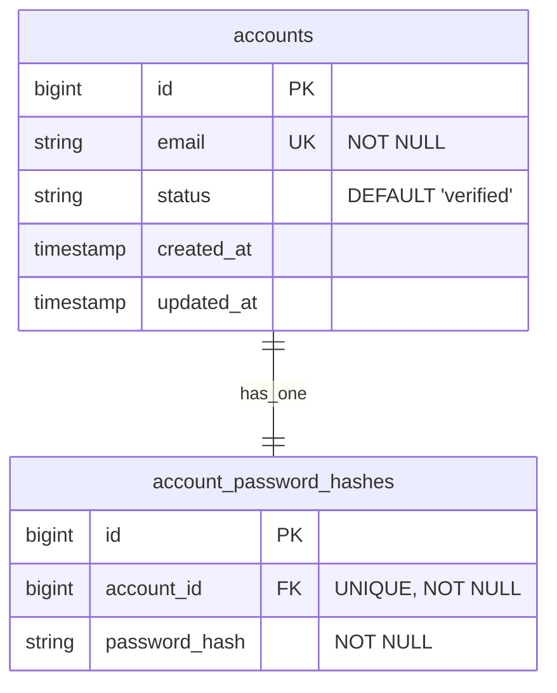
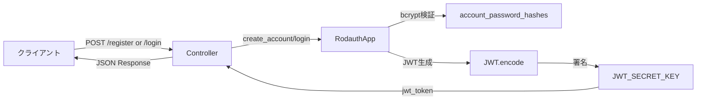
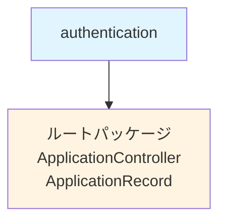
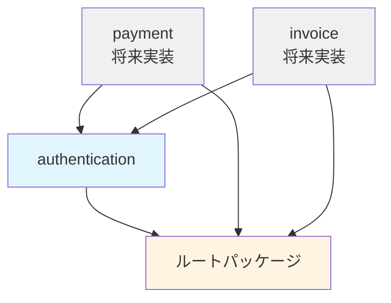
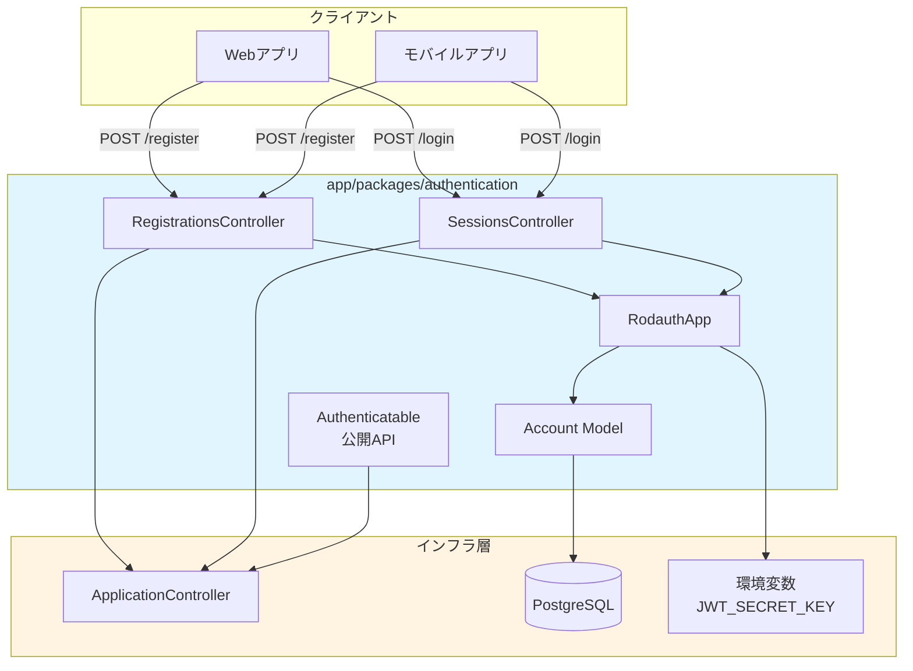

# 認証機能 設計書

## 設計判断

### アーキテクチャ選定

| 項目 | 選定技術 | 理由 |
|------|---------|------|
| **認証ライブラリ** | Rodauth | Rails標準的なセキュリティ機能、JWT対応、拡張性が高い |
| **トークン方式** | JWT (HS256) | ステートレス認証、APIモードに最適 |
| **パスワードハッシュ** | bcrypt | 業界標準、Rodauth標準サポート |
| **パッケージ配置** | `app/packages/authentication/` | モジュラーモノリスの原則に従い独立ドメインとして配置 |

### 重要な判断基準

1. **最小構成から開始**
   - 初期リリースは登録とログインのみ
   - 将来的な拡張（トークンリフレッシュ、パスワードリセット等）は段階的に追加

2. **ステートレス認証**
   - JWTのみ使用、セッションストアは使用しない
   - ログアウト機能は不要（クライアント側でトークン破棄）

3. **Packwerk境界の尊重**
   - 他パッケージから利用される機能は `app/public/` に配置
   - 内部実装（Controller, Model等）は非公開

4. **テスト戦略**
   - モデル層（Account）はユニットテストで厚く検証
   - API層（Controller）はリクエストスペックで最小限検証
   - RSwagでOpenAPI仕様を自動生成

## パッケージ構造案

```
app/packages/authentication/
├── package.yml                           # Packwerk設定
├── app/
│   ├── controllers/
│   │   └── authentication/
│   │       ├── registrations_controller.rb  # ユーザー登録
│   │       └── sessions_controller.rb       # ログイン
│   ├── models/
│   │   └── account.rb                       # ユーザーモデル
│   ├── lib/
│   │   └── rodauth_app.rb                   # Rodauth設定クラス
│   └── public/                               # 公開API
│       └── authentication/
│           └── authenticatable.rb            # 認証concern（他パッケージ向け）
└── spec/
    ├── models/
    │   └── account_spec.rb                   # ユニットテスト
    └── requests/
        └── authentication/
            ├── registrations_spec.rb         # 登録APIテスト
            └── sessions_spec.rb              # ログインAPIテスト
```

### package.yml

```yaml
enforce_dependencies: true
enforce_privacy: true

dependencies:
  - "."  # ルートパッケージ（ApplicationController, ApplicationRecord等）

public_path: app/public
```

## 主要クラス・ファイルの責務

### 1. RodauthApp (`app/lib/rodauth_app.rb`)

**責務:**
- Rodauth設定の中心クラス
- JWT生成・検証ロジック
- アカウント作成・ログイン処理

**主要メソッド:**
```ruby
class RodauthApp < Rodauth::Rails::App
  configure do
    enable :login, :create_account, :jwt

    jwt_secret ENV.fetch("JWT_SECRET_KEY")
    jwt_expiration 3600  # 1時間

    accounts_table :accounts
    account_password_hash_column :password_hash
    account_status_column :status

    skip_status_checks? true  # メール確認なし
  end
end
```

### 2. Account (`app/models/account.rb`)

**責務:**
- ユーザー情報管理
- メールアドレスバリデーション
- メール正規化（小文字変換）
- アカウントステータス管理（Enum）

**Enum定義:**
```ruby
enum status: {
  unverified: "unverified", # メール未確認
  verified: "verified",     # メール確認済み（デフォルト）
  locked: "locked",         # アカウントロック
  closed: "closed"          # アカウント閉鎖
}, _prefix: true
```

**利用可能なメソッド:**
- `account.status_verified?` / `account.status_locked?` など
- `account.status_verified!` / `account.status_locked!` など（更新+保存）
- `Account.status_verified` / `Account.status_locked` など（スコープ）

**バリデーション:**
- `email`: 必須、メール形式、一意性（大文字小文字区別なし）
- `status`: デフォルト "verified"（メール確認スキップ）、Enumで型安全性確保

**コールバック:**
- `before_validation :normalize_email` → 小文字・trim処理

### 3. Authentication::RegistrationsController

**エンドポイント:** `POST /api/v1/auth/register`

**リクエスト:**
```json
{
  "email": "user@example.com",
  "password": "secure_password123"
}
```

**レスポンス（成功）:**
```json
{
  "jwt": "eyJhbGciOiJIUzI1NiIsInR5cCI6IkpXVCJ9...",
  "account": {
    "id": 1,
    "email": "user@example.com"
  }
}
```

**レスポンス（失敗）:**
```json
{
  "error": {
    "code": "REGISTRATION_FAILED",
    "message": "Email has already been taken",
    "trace_id": "682d608d-d8e7-45cc-abd8-a2b75d30c0bf"
  }
}
```

### 4. Authentication::SessionsController

**エンドポイント:** `POST /api/v1/auth/login`

**リクエスト:**
```json
{
  "email": "user@example.com",
  "password": "secure_password123"
}
```

**レスポンス（成功）:** RegistrationsControllerと同じ

**レスポンス（失敗）:**
```json
{
  "error": {
    "code": "LOGIN_FAILED",
    "message": "Invalid email or password",
    "trace_id": "682d608d-d8e7-45cc-abd8-a2b75d30c0bf"
  }
}
```

### 5. Authentication::Authenticatable (`app/public/authentication/authenticatable.rb`)

**責務:**
- 他パッケージから利用可能な認証ヘルパー
- JWT検証・デコード
- `current_account` 提供

**公開メソッド:**
```ruby
module Authentication::Authenticatable
  # before_action :authenticate_account! で使用
  def authenticate_account!
    # Authorizationヘッダーからトークン抽出
    # JWT検証・デコード
    # @current_accountに設定
    # 失敗時は401レスポンス
  end

  private

  attr_reader :current_account
end
```

**使用例（他パッケージ）:**
```ruby
# app/packages/payment/app/controllers/payment/invoices_controller.rb
class Payment::InvoicesController < ApplicationController
  before_action :authenticate_account!

  def index
    # current_account が利用可能
    invoices = current_account.invoices
    render json: invoices
  end
end
```

## データモデル

### ER図



### テーブル定義

#### accounts

| カラム | 型 | 制約 | 説明 |
|--------|---|------|------|
| id | bigint | PK, AUTO_INCREMENT | アカウントID |
| email | string | NOT NULL, UNIQUE | メールアドレス（小文字正規化済み） |
| status | string | NOT NULL, DEFAULT 'verified' | アカウントステータス（今回は固定） |
| created_at | timestamp | NOT NULL | 作成日時 |
| updated_at | timestamp | NOT NULL | 更新日時 |

**インデックス:**
- PRIMARY KEY: `id`
- UNIQUE INDEX: `email`

#### account_password_hashes

| カラム | 型 | 制約 | 説明 |
|--------|---|------|------|
| id | bigint | PK, AUTO_INCREMENT | ID |
| account_id | bigint | FK → accounts.id, UNIQUE, NOT NULL | アカウントID |
| password_hash | string | NOT NULL | bcryptハッシュ |

**インデックス:**
- PRIMARY KEY: `id`
- UNIQUE INDEX: `account_id`

**外部キー:**
- `account_id` → `accounts.id` (ON DELETE CASCADE)

## 公開API・イベント

### 公開API（他パッケージ向け）

| モジュール/クラス | 配置 | 公開メソッド | 用途 |
|------------------|------|-------------|------|
| `Authentication::Authenticatable` | `app/public/authentication/authenticatable.rb` | `authenticate_account!`<br/>`current_account` | Controllerに includeして認証機能を提供 |

### 内部API（非公開）

- `Authentication::RegistrationsController` → 外部公開（HTTP API）だがパッケージ内部実装
- `Authentication::SessionsController` → 同上
- `Account` モデル → パッケージ内部のみ
- `RodauthApp` → パッケージ内部のみ

## データフロー

### JWT発行フロー



### JWT検証フロー

```mermaid
flowchart LR
    A[クライアント] -->|Authorization: Bearer <jwt>| B[Controller]
    B -->|authenticate_account!| C[Authenticatable]
    C -->|extract_token| D[Request Header]
    C -->|JWT.decode| E[JWT_SECRET_KEY]
    E -->|account_id| F[DB: accounts]
    F -->|@current_account| B
    B -->|処理継続| G[Business Logic]
```

## Packwerk依存方針

### authentication パッケージの依存関係



**依存ルール:**
- ✅ `authentication` → ルートパッケージ（`.`）
- ❌ `authentication` → 他のドメインパッケージ（禁止）

### 他パッケージからの依存



**将来の他パッケージからの利用:**

```yaml
# app/packages/payment/package.yml
enforce_dependencies: true
enforce_privacy: true

dependencies:
  - "."
  - "app/packages/authentication"  # 追加
```

## テスト戦略

### 1. ユニットテスト（Model層）

**対象:** `Account` モデル

**テストケース:**
- バリデーション
  - email: 必須、メール形式、一意性
  - 大文字小文字を区別しない一意性
- 正規化ロジック
  - メールアドレスが小文字に変換される
  - 前後の空白がトリムされる
- 境界値テスト
  - 空文字、nil、長いメールアドレス
  - 無効なメール形式（`@なし`、`ドメインなし`等）

**ツール:**
- RSpec
- shoulda-matchers（バリデーションマッチャー）
- FactoryBot

**カバレッジ目標:** 100%

### 2. リクエストテスト（Controller層）

**対象:** RegistrationsController, SessionsController

**テストケース（最小限）:**

#### POST /api/v1/auth/register
- ✅ 正常系: 登録成功、JWTが返却される
- ❌ 異常系: メールアドレス重複（422）
- ❌ 異常系: 無効なメール形式（422）
- ❌ 異常系: パスワード未入力（422）

#### POST /api/v1/auth/login
- ✅ 正常系: ログイン成功、JWTが返却される
- ❌ 異常系: 未登録メールアドレス（401）
- ❌ 異常系: パスワード誤り（401）

#### 保護されたエンドポイント（サンプル）
- ✅ 正常系: 有効なJWTでアクセス成功
- ❌ 異常系: JWTなし（401）
- ❌ 異常系: 無効なJWT（401）
- ❌ 異常系: 期限切れJWT（401）

**ツール:**
- RSpec Request Spec
- RSwag（OpenAPI仕様生成）

**カバレッジ目標:** 主要パス 100%

### 3. セキュリティテスト

**確認項目:**
- [ ] パスワードが平文でDBに保存されない（bcrypt確認）
- [ ] JWT秘密鍵が環境変数管理されている
- [ ] ログイン失敗時にアカウント存在を推測できない（メッセージ統一）
- [ ] SQLインジェクション対策（パラメータ化クエリ）

**ツール:**
- Brakeman（静的解析）
- Bundler Audit（gem脆弱性チェック）

### テスト実行コマンド

```bash
# ユニットテストのみ
bundle exec rspec spec/models/account_spec.rb

# リクエストテストのみ
bundle exec rspec spec/requests/authentication/

# 全テスト
bundle exec rspec

# RSwag仕様生成
RAILS_ENV=test bundle exec rake rswag:specs:swaggerize
```

## リスク・代替案

### リスク1: JWT秘密鍵の漏洩

**影響:** 全てのトークンが偽造可能になる

**対策:**
- 環境変数で管理（`.env` はGit管理外）
- 本番環境では定期的にローテーション
- 将来的にRS256（公開鍵暗号）への移行を検討

### リスク2: トークンリフレッシュなし

**影響:** 有効期限（1時間）後に再ログインが必要

**対策:**
- 初期リリースは許容範囲
- 将来的にリフレッシュトークン機能を追加

**代替案:**
- 有効期限を長くする（24時間等） → セキュリティリスク増加

### リスク3: ログイン失敗時のブルートフォース攻撃

**影響:** 総当たり攻撃でパスワード破られる可能性

**対策（将来対応）:**
- Rack::Attackによるレート制限
- アカウントロック機能（Rodauth機能活用）

## マイグレーションパス

### Phase 1: 初期実装（今回）
- ユーザー登録・ログイン
- JWT発行・検証
- 最小限のバリデーション

### Phase 2: セキュリティ強化（将来）
- レート制限（Rack::Attack）
- アカウントロック機能
- ログイン履歴管理

### Phase 3: 利便性向上（将来）
- トークンリフレッシュ
- パスワードリセット（メール送信）
- メール確認機能

### Phase 4: エンタープライズ対応（将来）
- SSO連携（OAuth, SAML）
- 2要素認証（2FA）
- 監査ログ

## 参考図

### コンポーネント図


