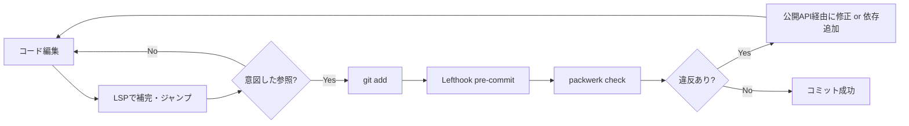
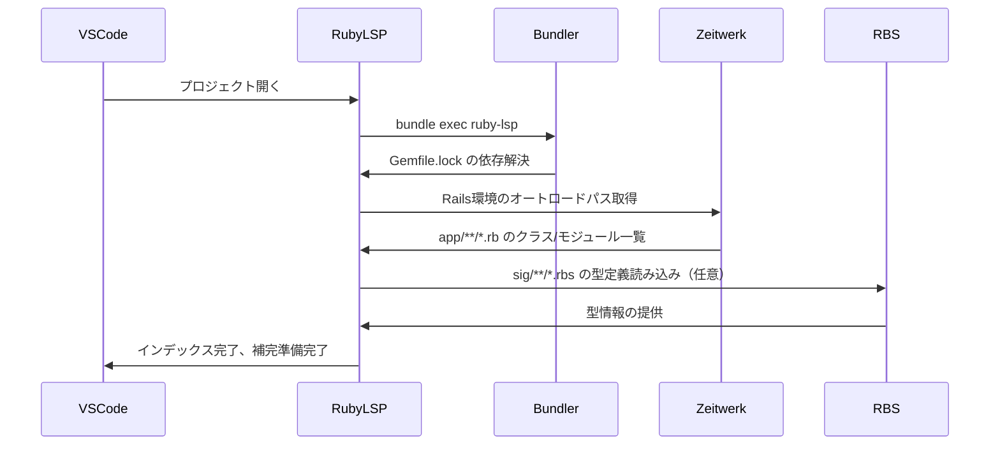
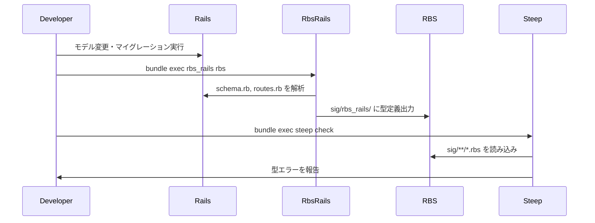

# VS Code + Ruby LSP導入 - 設計書

## 設計判断の背景

### なぜ Ruby LSP なのか

**比較検討した選択肢:**

| ツール | メリット | デメリット | 判断 |
|--------|----------|----------|------|
| **Ruby LSP** | Shopify製で活発にメンテナンス、Rails/RSpec統合が強力 | 型情報なしでは補完精度に限界 | ✅ 採用 |
| Solargraph | 歴史が長く、型推論がやや強力 | メンテナンス頻度が低下傾向 | ❌ 不採用 |
| Sorbet | 型チェックが強力、大規模プロジェクト向け | 学習コストが高い、プロジェクト方針で不使用 | ❌ 不採用 |

**決定理由:**

- Shopifyの公式サポートで長期的な安定性が見込める
- Rails 7.2、RSpec 7.1 への対応が迅速
- Packwerk境界とは独立して動作（両立可能）
- RBS/Steepとの連携で段階的に型強化できる

### bundler 経由での起動

**方針:**

```json
{
  "rubyLsp.rubyVersionManager": "bundler",
  "rubyLsp.rubyCommand": "bundle"
}
```

**理由:**

- asdf管理のRubyを安定的に使用できる（PATHの問題を回避）
- プロジェクトの `Gemfile.lock` に固定されたGemバージョンを使用
- CI環境との挙動差を最小化

**代替案とその不採用理由:**

- `"rubyVersionManager": "asdf"` - VS CodeのPATH認識が不安定
- `"rubyVersionManager": "none"` - システムgemとの混在リスク

### Zeitwerk準拠の徹底

**設計方針:**

LSPの定義ジャンプはZeitwerkのオートロード規則に完全に依存する。以下を定期的に実行する：

```bash
bin/rails zeitwerk:check
```

**Packwerk環境での特記事項:**

- `app/packages/*/app/` 配下もZeitwerk管理対象
- パッケージ名 ≠ クラス名のプレフィックス（Packwerkは名前空間を強制しない）
- 公開API（`app/public/`）でも同様にZeitwerk準拠が必要

**命名規則の統一:**

| ファイルパス | クラス名 | 判定 | 理由 |
|-------------|---------|------|------|
| `app/packages/payment/app/models/invoice.rb` | `class Invoice` | ✅ OK | Zeitwerk準拠 |
| `app/packages/payment/app/models/payment_invoice.rb` | `class PaymentInvoice` | ✅ OK | Zeitwerk準拠 |
| `app/packages/payment/app/models/invoice.rb` | `class PaymentInvoice` | ❌ NG | ファイル名と不一致 |
| `app/packages/payment/app/public/repository.rb` | `class PaymentRepository` | ❌ NG | Zeitwerk非準拠（名前空間不要） |
| `app/packages/payment/app/public/repository.rb` | `class Repository` | ✅ OK | Zeitwerk準拠 |

### Packwerk境界の扱い

**重要な原則:**

> **LSPはPackwerk境界を無視する**
>
> - LSPは全てのクラスにジャンプ・補完可能
> - Packwerkは `package.yml` の `dependencies` と `enforce_privacy` で境界を強制
> - 両者は独立したレイヤーとして共存

**開発フロー:**



**対策:**

1. **Lefthookで自動チェック** - 既に `.lefthook.yml` に設定済み
2. **公開API設計の徹底** - `app/packages/*/app/public/` のみ他パッケージから参照
3. **依存関係の明示** - `package.yml` の `dependencies` を正しく記述

**Packwerk違反の具体例:**

```ruby
# app/packages/billing/app/services/export_service.rb
class ExportService
  def call
    # ❌ LSPは補完するが、Packwerk違反！
    # app/packages/payment/app/models/invoice.rb（非公開）
    Invoice.all
  end
end
```

```bash
# packwerk check の出力
Dependency violation: ::Invoice belongs to 'app/packages/payment',
but 'app/packages/billing' does not specify a dependency on 'app/packages/payment'.
```

**修正方針:**

```yaml
# app/packages/billing/package.yml
dependencies:
  - "."
  - "app/packages/payment"  # 依存を追加
```

または

```ruby
# app/packages/payment/app/public/invoices_repository.rb（公開API）
class InvoicesRepository
  def self.all
    Invoice.all
  end
end

# app/packages/billing/app/services/export_service.rb
class ExportService
  def call
    # ✅ 公開API経由
    InvoicesRepository.all
  end
end
```

## パッケージ構造案

このプロジェクトでは、ドメインパッケージは `app/packages/<domain>/` に配置するが、LSP設定自体はパッケージ化不要。

### ディレクトリ構成

```text
.
├── .vscode/
│   └── settings.json              # プロジェクト全体のLSP設定
├── Gemfile                         # ruby-lsp, ruby-lsp-rails などを追加
├── .lefthook.yml                   # zeitwerk:check, steep check を統合（任意）
├── rbs_collection.yaml             # RBS導入時（任意）
├── sig/
│   └── rbs_rails/                  # 自動生成される型定義（任意）
└── specs/
    └── vscode-lsp-setup/           # このドキュメント
        ├── requirements.md
        ├── design.md
        └── tasks.md
```

**設定ファイルの責務:**

- `.vscode/settings.json` - LSP起動設定、ファイル監視除外、インレイヒント
- `Gemfile` - LSP関連gemの依存管理
- `.lefthook.yml` - 型チェック統合（RBS/Steep導入後）
- `rbs_collection.yaml` - 依存gemの型定義解決（RBS導入後）

## 公開API・イベント設計

LSP自体は外部APIを持たないが、RBS導入時の型定義は他パッケージから参照可能。

### RBS型定義の管理方針

**選択肢:**

| 方針 | メリット | デメリット | 判断 |
|------|----------|----------|------|
| **Git管理する** | 型定義の差分レビューが可能、CI高速化 | リポジトリサイズ増加、コンフリクトリスク | ✅ 推奨 |
| Git管理しない | リポジトリサイズ増加なし | CI/開発環境で毎回生成が必要 | ❌ 非推奨 |

**決定:**

- `rbs_collection.lock.yaml` - **コミット必須**（依存型定義の再現性確保）
- `sig/rbs_rails/` - **コミット推奨**（型定義の差分レビュー、CI高速化）

**理由:**

- Rails由来の型定義（models, associations, routes）は頻繁に変更される
- 差分レビューでモデル変更の意図を把握しやすくなる
- CIで `rbs_rails rbs` を実行する時間を節約

**`.gitignore` に追加しない:**

```gitignore
# ❌ 不要
# /sig/rbs_rails/
```

## データフロー

### LSP起動時のフロー



### 型定義生成フロー（RBS導入後）



## Packwerk依存方針

LSP設定自体はドメインパッケージではないため、Packwerk依存関係は不要。

ただし、**型定義（RBS）の配置** については以下の方針を取る：

### RBS型定義の配置ルール

**全体共有の型定義:**

- `sig/` 直下に配置（Railsアプリ全体の型定義）
- `sig/rbs_rails/` - Rails由来の自動生成型
- `sig/app/` - カスタム型定義（任意）

**パッケージ固有の型定義:**

パッケージごとに型定義を分離する場合は以下の構成を検討：

```text
app/packages/payment/
├── sig/
│   └── payment.rbs              # Payment ドメインの型定義
└── app/
    └── models/
        └── invoice.rb
```

**Packwerk設定への影響:**

- RBS型定義自体はPackwerk境界の対象外
- 型定義が他パッケージのprivateクラスを参照する場合、Privacy違反にはならない
- ただし、実装コードでの参照は依然として違反

## テスト戦略

### LSP動作確認のテスト

**手動テスト:**

- [ ] 補完候補の表示（Ctrl+Space）
- [ ] 定義ジャンプ（F12）
- [ ] 参照検索（Shift+F12）
- [ ] ホバー時の型情報表示
- [ ] インレイヒントの表示（引数名、型情報）

**自動テスト（CI）:**

LSP自体の自動テストは困難だが、以下を代替とする：

- `bin/rails zeitwerk:check` - Zeitwerk準拠の検証
- `bundle exec packwerk check` - Packwerk境界の検証
- `bundle exec steep check` - 型チェック（RBS導入後）

### テストシナリオ

#### シナリオ1: 基本的な補完動作

```ruby
# app/packages/payment/app/models/invoice.rb
class Invoice < ApplicationRecord
  belongs_to :user
end

# ===== テスト対象 =====
# 別のファイルで以下を入力:
inv = Invoice.first
inv.u  # ← Ctrl+Space で "user" が補完されるか
```

**期待結果:**

- `user` メソッドが補完候補に表示される
- `user` にカーソルを合わせると「belongs_to :user」の情報が表示される

#### シナリオ2: Packwerk境界の検証

```ruby
# app/packages/billing/app/services/export_service.rb
class ExportService
  def call
    Invoice.all  # ← LSPは補完するが、Packwerk違反
  end
end
```

**期待結果:**

- LSPでは `Invoice` が補完される（ジャンプも可能）
- `bundle exec packwerk check` でDependency violationエラーが表示される
- Lefthook pre-commitでコミットが拒否される

#### シナリオ3: 型定義によるRails動的メソッド補完（RBS導入後）

```ruby
# app/packages/payment/app/models/invoice.rb
class Invoice < ApplicationRecord
  has_many :line_items
end

# ===== テスト対象 =====
inv = Invoice.first
inv.line_items.  # ← Ctrl+Space で ActiveRecord::Relation のメソッドが補完されるか
```

**期待結果:**

- `where`, `find_by`, `order` などのRelationメソッドが補完される
- RBS導入前と比較して補完精度が向上

### CI統合

**GitHub Actions例（RBS導入後）:**

```yaml
# .github/workflows/ci.yml
name: CI

on: [push, pull_request]

jobs:
  type-check:
    runs-on: ubuntu-latest
    steps:
      - uses: actions/checkout@v4
      - uses: ruby/setup-ruby@v1
        with:
          ruby-version: 3.4.6
          bundler-cache: true

      - name: Zeitwerk check
        run: bin/rails zeitwerk:check

      - name: Packwerk check
        run: bundle exec packwerk check

      - name: RBS collection install
        run: bundle exec rbs collection install

      - name: Generate RBS for Rails
        run: bundle exec rbs_rails rbs

      - name: Steep type check
        run: bundle exec steep check
```

## リスクと代替案

### リスク1: asdf環境のVS Code認識不良

**リスク内容:**

- VS Codeがasdfのshimパスを認識せず、LSPが起動しない
- システムRubyを誤って使用してしまう

**対策:**

- ターミナルから `code .` で起動する手順をドキュメント化
- `.vscode/settings.json` で `"rubyVersionManager": "bundler"` を使用

**代替案:**

- rbenvへの移行（ただし、プロジェクトは既にasdfを使用しているため非現実的）

### リスク2: Packwerk境界の無視

**リスク内容:**

- LSPで補完されたコードがPackwerk違反になる
- 開発者がPackwerk境界を意識しなくなる

**対策:**

- Lefthookで自動チェック（既に設定済み）
- 公開API設計の徹底（`app/packages/*/app/public/`）
- 定期的なPackwerk勉強会・レビュー

**代替案:**

- LSPプラグインでPackwerk境界を考慮した補完（現状では存在しない）

### リスク3: 型チェックの負荷増大

**リスク内容:**

- Steep導入でCI時間が増加（大規模プロジェクトで顕著）
- pre-commitでの型チェックが重すぎてストレスに

**対策:**

- 型チェックはpre-pushで実行（pre-commitでは実行しない）
- 差分のみチェック（`{staged_files}` を活用）
- CI並列実行の活用

**代替案:**

- 型チェックを任意化（開発者が手動実行）
- 重要なパッケージのみ型チェック対象にする

### リスク4: RBS型定義のメンテナンスコスト

**リスク内容:**

- Rails変更のたびに `rbs_rails rbs` の実行が必要
- 手動実行を忘れると型定義が古いまま

**対策:**

- Lefthookでの自動生成（差分検出時のみ）
- CIでの自動生成とコミット（自動PR生成）

**代替案:**

- RBS/Steepを導入しない（最小構成のまま運用）

## 参考資料

### 公式ドキュメント

- [Ruby LSP - Shopify](https://shopify.github.io/ruby-lsp/)
- [RBS - Ruby Signature](https://github.com/ruby/rbs)
- [Steep - Gradual Type Checker](https://github.com/soutaro/steep)
- [rbs_rails - RBS for Rails](https://github.com/pocke/rbs_rails)
- [Zeitwerk - Efficient and Thread-Safe Code Loader](https://github.com/fxn/zeitwerk)

### プロジェクト固有ドキュメント

- [doc/modular_monolith.md](../../doc/modular_monolith.md)
- [doc/packwerk_guide.md](../../doc/packwerk_guide.md)
- [CLAUDE.md](../../CLAUDE.md)
- [.lefthook.yml](../../.lefthook.yml)

### 関連Issue・ADR

- [1482c0d - Sorbet関連のRuboCopルール無効化](https://github.com/user/repo/commit/1482c0d)

## 設計判断ログ

| 日付 | 判断内容 | 理由 | 影響範囲 |
|------|---------|------|---------|
| 2025-10-21 | Ruby LSPを採用 | Shopify公式、Rails/RSpec統合が強力 | 全開発者 |
| 2025-10-21 | bundler経由でLSP起動 | asdf環境での安定性、Gemバージョン固定 | .vscode/settings.json |
| 2025-10-21 | RBS型定義をGit管理 | CI高速化、差分レビュー可能 | sig/rbs_rails/ |
| 2025-10-21 | Sorbet不使用 | プロジェクト方針（既決定） | 型チェック全般 |
| 2025-10-21 | zeitwerk:checkはpre-pushで実行 | Rails起動コストが高い | .lefthook.yml |
