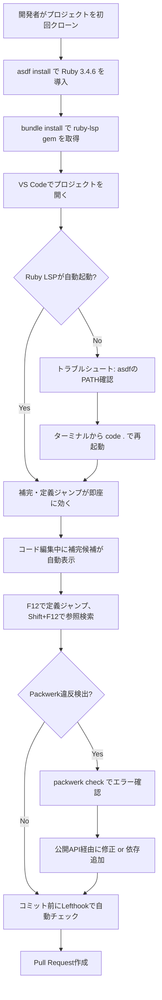
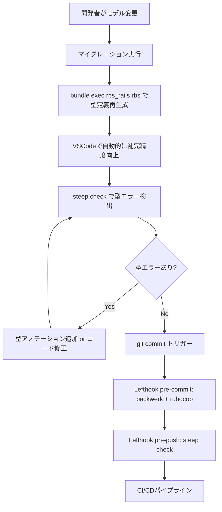

# VS Code + Ruby LSP導入 - 要件定義

## 背景

### 現在の開発環境の課題

- [ ] コード補完が貧弱で、メソッド名やクラス名の手入力が必要
- [ ] 定義ジャンプ（F12）が効かず、Grep検索に頼らざるを得ない
- [ ] Rails特有の動的メソッド（associations, scopesなど）が補完されない
- [ ] リファクタリング時の影響範囲把握に時間がかかる
- [ ] 開発者ごとにエディタ環境が異なり、開発効率にばらつきがある

### モジュラーモノリス特有の課題

このプロジェクトは Packwerk でパッケージ境界を強制しているが、LSP単体では以下の制約がある：

- **LSPとPackwerkの動作差**: LSPはPackwerk境界を考慮せず、全てのクラスにジャンプ・補完可能
- **依存違反の見落とし**: LSPで補完されたコードが実際にはPackwerk違反になるケースがある
- **公開API設計の重要性**: `app/packages/*/app/public/` を正しく設計しないと、開発体験が悪化する

## 目的

### 主目的

開発体験（DX）を大幅に向上させることで、開発速度と品質を同時に向上させる。

- [ ] コード補完の充実（メソッド名、クラス名、引数の型情報）
- [ ] 定義ジャンプの確実性（Zeitwerk準拠のクラス/ファイル構造）
- [ ] Rails特有のDSL補完（has_many, scopeなど）
- [ ] リファクタリング支援（Find References, Renameなど）

### 副次的な効果

- [ ] 新規参画者のオンボーディング時間短縮（エディタが"教科書"になる）
- [ ] コードレビュー時の負担軽減（型情報が明示されることで意図が伝わりやすい）
- [ ] ドキュメント作成の省力化（型定義がドキュメントとして機能）

## スコープ

### 対象範囲（In-Scope）

#### フェーズ1: 最小構成（5分で動く）

- [ ] Ruby LSP拡張のインストール（VS Code）
- [ ] Gemfileへの追加（ruby-lsp, ruby-lsp-rails, ruby-lsp-rspec）
- [ ] `.vscode/settings.json` の作成（bundler経由でLSP起動）
- [ ] 動作確認（補完・定義ジャンプ）

#### フェーズ2: 実務強化（任意）

- [ ] vendor/bundle 使用の検討（パフォーマンス改善）
- [ ] ワークスペース分割の検討（大規模リポジトリ向け）
- [ ] files.watcherExclude の最適化（不要なファイル監視を除外）

#### フェーズ3: 型連携（RBS/Steep）

- [ ] RBS/Steep導入の検討（Sorbet不使用方針に準拠）
- [ ] rbs_rails による Rails型定義の自動生成
- [ ] Lefthookへの型チェック統合（pre-push推奨）
- [ ] RBS成果物の管理方針決定（コミット対象にするか）

### 対象外（Out-of-Scope）

- ❌ Sorbet導入（プロジェクト方針で不使用と決定済み: [1482c0d](https://github.com/user/repo/commit/1482c0d)）
- ❌ 他エディタ（RubyMine, Vim, Emacsなど）の設定
- ❌ LSP以外の補完エンジン（Solargraph など）
- ❌ 型定義の完全な網羅（段階的導入を前提とする）

## 業務・ユーザーフロー

### 開発者が型補完を受けるまでの流れ

### 型チェック統合時のフロー（RBS/Steep導入後）

## 非機能要件

### パフォーマンス要件

- [ ] LSPの起動時間: プロジェクトルートを開いてから30秒以内に起動完了
- [ ] 補完候補の表示遅延: キー入力から500ms以内に候補表示
- [ ] インデックス時間: 初回インデックス完了まで3分以内（通常のRailsプロジェクトで）

### 保守性要件

- [ ] Zeitwerkチェックの定期実行（週1回以上推奨）
- [ ] RBS型定義の自動生成スクリプト整備（モデル変更時に手動実行不要に）
- [ ] Lefthook統合による自動チェック（開発者の手作業を削減）

### 互換性要件

- [ ] Ruby 3.4.6（asdf管理）との完全互換
- [ ] Rails 7.2.2 の動的メソッド補完対応
- [ ] Packwerk 3.2 の境界違反を検出（LSPとは別レイヤー）

### 運用要件

- [ ] CIでの型チェック実行（RBS/Steep導入後）
- [ ] RBS成果物のバージョン管理方針（後述のdesign.mdで決定）
- [ ] 新規参画者向けのセットアップドキュメント（このspecsディレクトリが兼ねる）

## ステークホルダー

### 主要ステークホルダー

- **開発チーム全員**: LSPの恩恵を受ける
- **テックリード**: 型チェック統合方針の決定、RBS管理ルールの策定
- **新規参画者**: オンボーディング時のセットアップガイド利用者

### 関連ステークホルダー

- **CI/CDパイプライン管理者**: 型チェックの統合、実行時間の最適化
- **コードレビュアー**: 型情報による意図の明確化から恩恵を受ける

## 観測指標（Metrics）

### 開発体験（DX）指標

- [ ] 補完利用率: コード入力時に補完候補を選択した割合（LSPログから推定）
- [ ] 定義ジャンプ成功率: F12押下時に正しい定義へジャンプできた割合
- [ ] 検索回数の削減: Grep検索の実行回数（LSP導入前後で比較）

### 品質指標

- [ ] Packwerk違反の早期検出: LSPで補完されたがPackwerkで弾かれたケースの件数
- [ ] 型エラー検出率: Steep導入後の型エラー検出数（バグの事前防止）
- [ ] Zeitwerk違反の減少: 定期チェックでの違反件数推移

### 効率指標

- [ ] オンボーディング時間: 新規参画者がコード理解に要する時間
- [ ] リファクタリング時間: 大規模変更時の影響範囲調査時間
- [ ] コードレビュー時間: 型情報が明示されることでレビュー時間短縮

## 成功基準

### フェーズ1（最小構成）

- [ ] 開発者全員がRuby LSPを使えている（VS Codeステータスバーで確認）
- [ ] 基本的な補完・定義ジャンプが動作している
- [ ] トラブルシュート対応が完了し、セットアップが10分以内で完了する

### フェーズ2（実務強化）

- [ ] パフォーマンス要件を満たしている（上記の非機能要件参照）
- [ ] Zeitwerkチェックが定期実行され、違反が発生していない
- [ ] Packwerk境界とLSP挙動の違いが開発者全員に周知されている

### フェーズ3（型連携）

- [ ] RBS/Steepが導入され、CIで型チェックが実行されている
- [ ] Rails由来の動的メソッドが補完される（rbs_railsの効果）
- [ ] 型エラーが事前に検出され、本番環境でのランタイムエラーが減少

## リスクと制約

### リスク

- **asdf環境のVS Code認識不良**: PATHが通らず、LSPが起動しないケース
  - **対策**: ターミナルから `code .` で起動する手順をドキュメント化
- **Packwerk境界の無視**: LSPで補完されたコードがPackwerk違反になるケース
  - **対策**: Lefthookで packwerk check を自動化（既に設定済み）
- **型チェックの負荷**: Steep導入でCI時間が増大
  - **対策**: pre-pushでの実行、差分チェックの活用

### 制約

- **Sorbet不使用**: プロジェクト方針により、型システムはRBS/Steepに限定
- **Ruby 3.4系の対応状況**: RBS/Steepの最新版が必要（互換性確認が必須）
- **vendor/bundle管理方針**: デフォルトではシステムgemを使用（変更時はチーム合意が必要）

## 関連ドキュメント

- [doc/modular_monolith.md](../../doc/modular_monolith.md) - Packwerk構成の全体像
- [doc/packwerk_guide.md](../../doc/packwerk_guide.md) - Packwerk使用方法
- [.lefthook.yml](../../.lefthook.yml) - Git Hooks設定
- [CLAUDE.md](../../CLAUDE.md) - プロジェクト概要と開発コマンド
